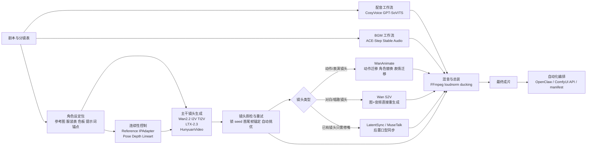

# 剧情连贯视频多工作流逻辑归纳

这份文档是对 [deep-research-report (1).md](./deep-research-report%20(1).md) 的工程化压缩版。重点不是重复列模型信息，而是回答一个更直接的问题：

**为什么剧情视频通常不能靠一张超级工作流做完，而要拆成多条工作流协作。**

## 一句话结论

想同时做到剧情连续、角色稳定、表情自然、口型准确、配音和 BGM 不打架，最稳的做法不是追求“一个图全包”，而是把流程拆成：

1. 主干镜头生成工作流
2. 连续性控制工作流
3. 表演/动作迁移工作流
4. 口型同步工作流
5. 配音工作流
6. 音乐与混音工作流
7. 自动化编排工作流

每条工作流只解决自己最擅长的问题，最后再总装。

## 总体逻辑图

## 各类工作流到底负责什么

| 工作流类型 | 代表模型/工具 | 主要输入 | 主要输出 | 它负责解决的问题 | 它不该承担的问题 |
| --- | --- | --- | --- | --- | --- |
| 主干镜头生成 | Wan2.2 I2V/TI2V、LTX-2.3、HunyuanVideo | 分镜 prompt、参考图、首尾帧 | 单个剧情镜头 | 生成画面、镜头运动、基础时序一致性 | 精确口型、最终混音、全片调度 |
| 连续性控制 | Reference、IPAdapter、Pose、Depth、Lineart、ControlNet | 角色参考图、姿态图、深度图、线稿 | 附加控制条件或受控镜头 | 压住角色漂移、构图漂移、动作走样 | 独立完成整部片子 |
| 表演/动作迁移 | Wan2.2 Animate、WanAnimate | 角色参考图、动作视频、表情视频 | 表演镜头、替换镜头 | 让特定角色复现动作和表情 | 全片普通镜头生成、精确对白嘴型 |
| 口型同步 | LatentSync、MuseTalk | 已有视频、最终配音音频 | 修正口型后的视频 | 音素对齐、嘴部开合 | 重新设计剧情镜头、生成自然体态 |
| 配音 | CosyVoice、GPT-SoVITS | 台词文本、目标音色样本 | 最终对白音频 | 声线、语气、自然度 | 自动保证口型准确 |
| 音乐与混音 | ACE-Step、Stable Audio、FFmpeg | BGM prompt、对白音频、视频 | 最终音轨或带声视频 | 音乐生成、响度统一、BGM 让位 | 生成视觉画面 |
| 自动化编排 | OpenClaw、ComfyUI API、脚本 | 工作流 JSON、节点映射、任务清单 | 可批量重跑的生产线 | 队列化、断点恢复、结果落盘 | 替代具体生成模型 |

## 1. 主干镜头生成工作流

### 逻辑

主干镜头工作流负责把“一个镜头”从无到有做出来。它是整条生产线的骨架，通常按镜头切片运行，而不是一次性生成整段长视频。

### 为什么它必须独立出来

- 它的目标是把构图、主体、镜头运动和基础画面质量先做对。
- 如果把 lipsync、混音、字幕、自动化调度都塞进同一张图，失败成本会非常高。
- 剧情连续的核心不是一次出很长，而是把每个镜头做稳，再拼起来。

### 适合做的事

- 普通剧情镜头
- 转场镜头
- 非对白的动作镜头底片
- 3 到 8 秒的可控镜头

### 常见代表

- Wan2.2 I2V/TI2V：当前最适合作为剧情镜头主力底座
- LTX-2.3：适合高规格短镜头、关键镜头
- HunyuanVideo 1.5：适合 24GB 级本地部署的替代主干

## 2. 连续性控制工作流

### 逻辑

连续性控制工作流不是单独出片，而是给主干镜头“加约束”。

它的职责是：让角色不要换脸、服装不要乱变、动作不要偏离、构图不要飘。也就是说，它更像“控制层”，不是“生成层”。

### 常见控制信号

- 参考图：锁角色身份
- IPAdapter / Reference：锁人物气质、服装、画风
- Pose：锁动作姿态
- Depth：锁空间关系和透视
- Lineart / Canny：锁轮廓和构图
- 首尾帧锚定：锁镜头前后衔接

### 适合做的事

- 同一角色跨镜头保持一致
- 把漫画分镜、草图、姿态图转成可控镜头
- 保留原视频结构，只改风格或人物

### 不适合单独承担的事

- 单独出整部剧情视频
- 精确对白嘴型
- 取代后期混音

## 3. 表演/动作迁移工作流

### 逻辑

这类工作流解决的不是“镜头怎么生成”，而是“这个角色怎么演”。

当你已经知道角色是谁、背景大概是什么，只差一个更强的动作、表情、表演驱动时，就应该把镜头分流到 WanAnimate 这类工作流。

### 它特别适合的镜头

- 跳舞镜头
- 唱歌表演镜头
- 角色替换镜头
- 动作迁移镜头
- 表情迁移镜头

### 它的核心输入

- 角色参考图
- 动作参考视频或 pose 序列
- 脸部表情区域或 face crops
- 可选背景遮罩

### 为什么不能用它替代所有镜头

- 它更偏表演层，不是全片主干层。
- 依赖参考素材质量，尤其依赖动作视频和姿态抽取结果。
- 它能让角色“演得像”，但不等于对白嘴型一定精确。

## 4. 对白与口型工作流

对白镜头必须单独分流，这是整条管线里最重要的规则之一。

### 路线 A：S2V 直接重生成

适合场景：

- 说话镜头本来就要重做
- 希望表情、头动、肢体也跟音频一起生成
- 静帧角色要“开口说话”

典型逻辑：

1. 输入角色静帧或关键帧
2. 输入最终版对白音频
3. 用 Wan S2V 直接生成说话镜头

优点：

- 神态更自然
- 省去“先生成再修嘴”的一轮往返

缺点：

- 属于重生成，不是小修小补
- 算力要求更高

### 路线 B：后置 lipsync 修口

适合场景：

- 原镜头已经好看
- 只是嘴型和台词对不上
- 想尽量保留原视频的动作和镜头设计

典型逻辑：

1. 主干工作流先出无对白或口型不准的镜头
2. TTS 先生成最终对白音频
3. 用 LatentSync 或 MuseTalk 只修嘴部

优点：

- 更适合批量修镜头
- 不会推翻已经满意的画面设计

缺点：

- 只能修嘴，不能顺便增强整体表演
- 对侧脸、遮挡、动漫夸张表情仍有限制

### 两条路线怎么选

| 情况 | 选哪条 |
| --- | --- |
| 镜头还没生成，且是重对白镜头 | 先走 S2V |
| 镜头已经满意，只差口型 | 走 LatentSync / MuseTalk |
| 想先快调参数，再高质量终修 | 先 MuseTalk，后 LatentSync |

## 5. 配音工作流

### 逻辑

配音工作流先把“声音”定稿，再把它交给口型工作流。顺序不能反。

### 原因

- 口型模型吃的是最终音频节奏
- 一旦后面再改文本、停顿、情绪，嘴型就要重新跑
- 所以“声音先定稿，视频后对齐”比反过来更省返工

### 典型分工

- CosyVoice：自然度、多语种、旁白和正常对白
- GPT-SoVITS：少样本克隆、已有目标音色的角色台词

### 这层的输出

- 最终对白 wav
- 按角色区分的音频资产
- 供 lipsync 使用的标准音频

## 6. 音乐与混音工作流

### 逻辑

音乐生成和最终混音应当放在视频工作流之外，单独处理。

### 原因

- 视频模型不擅长完成专业响度控制
- BGM 让位、人声清晰、整体音量一致，本质是音频工程问题
- 这一步更适合用 ACE-Step、Stable Audio、FFmpeg 完成

### 典型分工

- ACE-Step / Stable Audio：生成 BGM 或风格音乐
- FFmpeg：负责 loudnorm、ducking、limiter、拼接总装

### 最终职责

- 让人声不被 BGM 盖住
- 保证成片各镜头音量一致
- 把对白、BGM、视频真正合成可交付成片

## 7. 自动化编排工作流

### 逻辑

自动化层不是生成器，而是“生产线调度器”。

它负责：

- 调哪张 workflow JSON
- 给哪几个节点塞 prompt / 图像 / 音频
- 成功后把结果写到哪里
- 失败后从哪里重试

### 为什么要独立

- 生产期最怕的不是模型弱，而是重跑成本高
- 以镜头为任务单元，才能做断点恢复
- 一旦一个镜头失败，不应该拖垮整片

### 推荐做法

- 以 shot 为最小任务单位
- 每个 shot 独立记录 prompt、seed、输入图 hash、音频 hash
- 分阶段落盘：draft、refine、lipsync、mixdown
- 用 OpenClaw 或 ComfyUI API 做统一调度

## 按镜头类型选工作流

| 镜头类型 | 推荐主路线 | 说明 |
| --- | --- | --- |
| 普通剧情镜头 | 主干镜头生成 | Wan2.2 I2V/TI2V 优先 |
| 高规格关键镜头 | 主干镜头生成 + 连续性控制 | LTX-2.3 可作为关键镜头专线 |
| 漫画分镜改视频 | 主干镜头生成 + Pose/Depth/Lineart 控制 | 先保结构，再保风格 |
| 跳舞/唱歌表演镜头 | WanAnimate / Animate | 角色表演优先，不要直接走普通 I2V |
| 说话镜头，想整体更自然 | S2V | 图+音频直接生成 |
| 说话镜头，原画面已满意 | LatentSync / MuseTalk | 只修嘴型 |
| 局部修补镜头 | VACE / 视频修补链路 | 保留大部分画面，只修局部 |
| 最终导出 | FFmpeg / 总装链路 | 不建议交给视频生成图完成 |

## 一个更适合落地的最小组合

如果目标是“先在本地尽快搭出能跑通的剧情生产线”，最小组合可以简化为：

1. Wan2.2 I2V/TI2V：负责大多数剧情镜头
2. Pose / Depth / Reference：负责连续性控制
3. LatentSync 或 MuseTalk：负责对白镜头口型
4. CosyVoice 或 GPT-SoVITS：负责配音
5. ACE-Step：负责 BGM
6. FFmpeg：负责混音和成片总装
7. OpenClaw 或 ComfyUI API：负责排队和断点恢复

这条线不是功能最多的，但最接近“少人工、可批量、可恢复”的工程路线。

## 和当前本地 skill pack 的对应关系

下面这张表把报告里的抽象层，映射到当前工作区已经有或计划纳入的技能上，方便后续落地。

| 逻辑层 | 当前本地技能/工作流 |
| --- | --- |
| 主干镜头生成 | wan22_t2v_fast、wan22_i2v_api、ltx2_t2v_api、ltx2_i2v_api |
| 连续性控制 | ltx2_pose_to_video_api、ltx2_depth_to_video_api、ltx2_canny_to_video_api、lotus_depth_map_api |
| 表演/动作迁移 | WanAnimate 相关 UI 工作流，当前更适合单独维护与测试 |
| 视频修补 | wan_vace_api、ltx2_v2v_detailer_api |
| 后处理 | video_upscale_gan_api、video_stitch_api |
| 提示词与素材分析 | prompt_enhance_api、image_caption_gemini_api、video_caption_gemini_api |

## 最后记住的三条规则

1. 不要让一张工作流同时负责生成镜头、修嘴、混音和编排。
2. 对白镜头必须单独分流，先定音频，再做口型。
3. 真正的剧情连续，来自“分镜切片 + 统一角色设定 + 多工作流协作”，不是单次长视频硬跑。