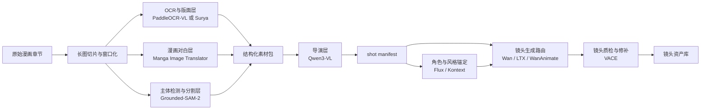

# 私有化漫画转动漫多模块工作流设计方案

这份文档是对现有剧情向多工作流方法论的进一步收敛，目标不是再讨论“应不应该拆工作流”，而是把一条可私有化部署、可逐步自动化、可按模块落地的漫画转动漫生产线定义清楚。

本文聚焦的组合如下：

- Qwen3-VL：导演层主模型
- Grounded-SAM-2：主体检测、分割、智能裁切层
- PaddleOCR-VL 或 Surya：OCR 与结构层
- Manga Image Translator：漫画对白与气泡层
- 现有本地生成栈：Wan / LTX / WanAnimate / VACE / Flux / Kontext

这套方案默认目标是纯私有化或可完全本地替代的部署路线，不把 Gemini、DINO-X API、Grounding DINO 1.5 云接口之类的在线服务作为主链依赖。

## 1. 目标与边界

### 核心目标

围绕长条漫画或多页漫画，构建一条能输出镜头清单和生成路由的前后端分层生产线，解决以下问题：

1. 从原始漫画中切出适合做视频的内容窗口。
2. 基于画面内容、对白、前后文理解剧情推进关系。
3. 在切分时筛掉不适合直接动画化的片段。
4. 自动生成贴合上下文的镜头提示词、连续性约束和工作流路由。
5. 把选中的镜头送入现有 ComfyUI 视频生成工作流批量执行。

### 非目标

这份设计文档不尝试解决以下问题：

1. 单个超大工作流一次性完成整章生成。
2. 一步到位做完配音、口型、字幕、BGM 和总装。
3. 依赖某一个神奇模型同时做好 OCR、剧情理解、镜头设计和视频生成。
4. 在当前文档内直接落具体部署脚本或服务代码。

### 设计原则

1. 模块分层，不追求单点全包。
2. 所有关键中间结果都可落盘、复跑、缓存和人工抽查。
3. 前处理与导演层先稳定，再追求后端生成全自动。
4. 所有模块优先支持离线、本地权重和结构化输出。

## 2. 一句话架构

先把漫画拆成连续观察窗口，再分别抽取结构信息、对白信息、视觉主体信息，最后由 Qwen3-VL 结合上下文生成 shot manifest，再把 manifest 中的镜头按类型路由到 Wan、LTX、WanAnimate、VACE、Flux/Kontext 等现有工作流执行。

## 3. 总体分层



## 4. 模块职责定义

## 4.1 长图切片与窗口化模块

### 作用

把超长 webtoon 或多页漫画转成适合模型分析的连续观察窗口，而不是一开始就强依赖传统 panel segmentation。

### 为什么必须先做这一步

1. 许多条漫没有稳定闭合 panel 边界。
2. 直接对整张超长图跑 VLM、OCR 或检测，计算量和误差都更大。
3. 先做窗口化可以保留上下文重叠，方便后面决定“切”还是“合”。

### 输入

- 原始章节目录或多页图片序列
- 每张图的原始宽高

### 输出

- 按顺序编号的窗口切片图
- 每个窗口的原始坐标范围
- 相邻窗口的重叠关系

### 关键要求

1. 保留原图坐标系，后续所有 bbox 和 crop 都要能映射回原图。
2. 窗口之间必须有重叠区域，避免角色或对白被硬切断。
3. 输出既支持 webtoon 长图，也支持普通分页漫画。

## 4.2 OCR 与结构层

### 推荐实现

- 方案 A：Surya
- 方案 B：PaddleOCR-VL 或 PaddleOCR 3.x + PP-StructureV3

### 作用

输出文字框、阅读顺序、版面区域、段落结构和粗粒度 layout 信息。

### 适合做的事

1. 提取文本框和阅读顺序。
2. 区分密集对白段、说明文字段、相对空白段。
3. 为导演层提供文本负载和版面密度特征。

### 不适合单独做的事

1. 判断剧情高潮或镜头价值。
2. 决定这个窗口是否适合直接做动画镜头。
3. 自动生成符合剧情上下文的提示词。

### 选择建议

1. 如果优先追求阅读顺序和工程接入稳定，优先 Surya。
2. 如果更看重中文和复杂结构的一体化处理，可优先 PaddleOCR-VL。
3. 后续部署时只需要先落一种，另一种保留为替换件或对照件。

## 4.3 漫画对白与气泡层

### 推荐实现

- Manga Image Translator

### 作用

对漫画特有的文本区域做补强，包括气泡文字检测、对白区域定位、去字辅助信息和对白抽取。

### 为什么不能只靠通用 OCR

漫画里的对白经常伴随：

1. 弯曲气泡或异形文本框。
2. 叠在插画上的对白。
3. 大字拟声词、特殊装饰字、对白与旁白混排。

Manga Image Translator 对这类输入通常比通用 OCR 更顺手。

### 输出建议

- bubble_boxes
- dialogue_blocks
- sfx_blocks
- cleaned_text_candidates

## 4.4 主体检测、分割与智能裁切层

### 推荐实现

- Grounded-SAM-2，使用本地 Grounding DINO + SAM2 权重

### 作用

为每个窗口生成“镜头候选视角”，包括人物、脸部、上半身、全身、道具、背景主体等可用于后续裁切的区域。

### 关键价值

这一层不是简单给 panel 框，而是帮助系统回答：

1. 这个窗口里视觉重点在哪里。
2. 适合切成特写、中景还是全景。
3. 后续提示词该强调谁、什么动作、什么物件。

### 输出建议

- object_boxes
- object_masks
- crop_candidates
- focus_subjects
- scene_density

### 部署约束

1. 默认不接 Grounding DINO 1.5 云接口。
2. 默认不接 DINO-X API。
3. 如需更稳定高分辨率推理，可保留 SAHI 切片推理能力。

## 4.5 导演层

### 推荐实现

- Qwen3-VL，本地部署

### 作用

这是一条生产线里最关键的模块。它不负责直接生成视频，而是负责生成结构化导演决策。

### 它要回答的问题

1. 当前窗口是剧情推进、对白、动作、反应、过渡还是说明性内容。
2. 当前窗口应独立成镜头，还是与前后窗口合并。
3. 当前窗口是否适合直接动画化。
4. 如果适合，最合适的镜头裁切和提示词是什么。
5. 这个镜头该路由到哪条生成工作流。

### 强制输出原则

导演层不能只输出自然语言描述，必须强制输出结构化 JSON。否则后面无法稳定编排。

### 推荐输出字段

- shot_id
- source_pages
- source_windows
- source_ranges
- merge_with_prev
- merge_with_next
- story_role
- shot_type
- anime_fit_score
- main_characters
- support_characters
- emotion
- action_level
- dialogue_summary
- continuity_notes
- crop_recommendation
- positive_prompt
- negative_prompt
- style_anchor
- workflow_route
- confidence

### workflow_route 建议枚举

- establish_scene
- dialogue_light_motion
- dialogue_heavy_expression
- action_performance
- transition_atmosphere
- repair_only
- skip

### anime_fit_score 建议用途

1. 低分片段直接跳过或进入人工复核队列。
2. 中分片段只做静态演出或低成本轻动。
3. 高分片段进入主生成链。

## 4.6 角色与风格锚定层

### 推荐实现

- Flux
- Kontext
- 角色参考图与风格参考图管理

### 作用

在正式批量生成前，把角色身份、服装、发型、配色、画风锚定下来，减少跨镜头漂移。

### 典型输入

- manifest 中高置信度的人物镜头
- 手工确认的角色代表图
- 漫画原始角色参考

### 典型输出

- character_bible
- style_bible
- prompt_anchor_pack

## 4.7 生成路由层

### 作用

根据 manifest 中的 shot_type、anime_fit_score 和 workflow_route，把镜头分发到现有 ComfyUI 工作流。

### 与现有本地栈的映射建议

1. establish_scene -> LTX 或 Wan 2.2 T2V/I2V
2. dialogue_light_motion -> Wan 2.2 I2V 或轻量 LTX I2V
3. dialogue_heavy_expression -> WanAnimate 或后续对白专用工作流
4. action_performance -> WanAnimate 优先
5. transition_atmosphere -> Wan 2.2 T2V / LTX T2V
6. repair_only -> VACE

### 当前已知可直接衔接的本地技能

基于现有注册表，当前至少可与以下技能或工作流直接衔接：

- wan22_t2v_fast
- wan22_i2v_api
- ltx2_t2v_api
- ltx2_i2v_api
- wan_vace_api

WanAnimate、Flux、Kontext 等路线可在后续部署时补导出为 API 工作流，再纳入统一路由层。

## 4.8 质检与修补层

### 作用

对生成结果做最小闭环：筛出破图、人物错位、运动异常、口型不协调、连续性崩坏的镜头，并把它们送回修补链。

### 推荐职责边界

1. VACE 负责视频修补和局部修复。
2. 角色和风格明显漂移时，回退到 Flux/Kontext 重新锚定。
3. 提示词或裁切明显不对时，回退到 manifest 阶段重跑导演层。

## 5. 结构化数据流

### 5.1 原始输入对象

```json
{
  "series_id": "example_series",
  "chapter_id": "ep001",
  "input_type": "webtoon",
  "pages": [
    {
      "page_id": "p001",
      "image_path": "runtime/input/example_series/ep001/0000_ep001_p001.jpg",
      "width": 1080,
      "height": 16500
    }
  ]
}
```

### 5.2 窗口切片对象

```json
{
  "window_id": "ep001_p001_w0003",
  "page_id": "p001",
  "image_path": "runtime/windows/example_series/ep001/p001/w0003.jpg",
  "source_box": [0, 4200, 1080, 6200],
  "overlap_prev": 240,
  "overlap_next": 240
}
```

### 5.3 结构化素材包

```json
{
  "window_id": "ep001_p001_w0003",
  "ocr_blocks": [],
  "dialogue_blocks": [],
  "sfx_blocks": [],
  "object_boxes": [],
  "object_masks": [],
  "crop_candidates": [],
  "reading_order": [],
  "scene_density": 0.62
}
```

### 5.4 shot manifest 对象

```json
{
  "shot_id": "ep001_s012",
  "source_pages": ["p001"],
  "source_windows": ["ep001_p001_w0003", "ep001_p001_w0004"],
  "source_ranges": [
    {"page_id": "p001", "box": [0, 4200, 1080, 7600]}
  ],
  "story_role": "dialogue_turning_point",
  "shot_type": "dialogue",
  "anime_fit_score": 0.87,
  "main_characters": ["char_a", "char_b"],
  "emotion": "tense_confession",
  "action_level": "low",
  "dialogue_summary": "角色A在压力下坦白关键信息，角色B明显动摇。",
  "continuity_notes": [
    "保持角色A外套颜色一致",
    "角色B视线始终朝左侧"
  ],
  "crop_recommendation": {
    "type": "medium_two_shot",
    "box": [110, 4450, 980, 6450]
  },
  "positive_prompt": "anime cinematic medium two-shot, tense confession, subtle breathing, restrained body motion, dramatic eye focus, indoor dramatic lighting",
  "negative_prompt": "extra fingers, inconsistent costume, exaggerated mouth, warped face, deformed anatomy",
  "style_anchor": "series_style_v1",
  "workflow_route": "dialogue_light_motion",
  "confidence": 0.83
}
```

## 6. 模块间接口约定

为了后续能分模块部署，建议每个模块都遵守统一接口：

1. 输入使用文件路径加 JSON 元数据，而不是只走内存对象。
2. 每一步都把结果落到独立 runtime 子目录。
3. 每一步都支持重复执行和断点续跑。
4. 每一步都返回 machine-readable 状态，而不是只打印日志。

### 推荐状态字段

- task_id
- stage
- status
- started_at
- finished_at
- input_refs
- output_refs
- error_message
- retry_count

## 7. 推荐目录规划

文档本身放在 agent-skills/docs/，但如果后续真的部署成独立项目，代码建议放到 agent-projects/ 下的新项目，例如：

```text
agent-projects/manga-anime-pipeline/
  README.md
  pyproject.toml 或 requirements.txt
  docs/
  configs/
  runtime/
    input/
    windows/
    structured/
    manifests/
    renders/
    qc/
  pipeline/
    ingest/
    ocr/
    dialogue/
    detection/
    director/
    routing/
    generation/
    qc/
  scripts/
```

## 8. 分阶段部署建议

### 阶段 1：最小可跑通版本

目标：先跑通从漫画到 shot manifest 的主链。

建议只部署：

1. 长图切片模块
2. Surya 或 PaddleOCR-VL 二选一
3. Manga Image Translator
4. Grounded-SAM-2
5. Qwen3-VL
6. manifest 落盘

这一阶段先不接全量视频生成，只验证：

1. 切分是否合理
2. anime_fit_score 是否可用
3. workflow_route 是否稳定
4. 提示词是否贴剧情

### 阶段 2：接入最小生成链

目标：把 manifest 中高分镜头送入现有本地工作流。

建议先接：

1. wan22_i2v_api
2. wan22_t2v_fast
3. ltx2_i2v_api
4. wan_vace_api

先不追求全自动，只验证路由逻辑和镜头质量闭环。

### 阶段 3：补角色锚定和动作分流

目标：提升角色稳定性和动作镜头表现。

建议补：

1. Flux / Kontext 角色风格锚定
2. WanAnimate 路由
3. 简单质检与补跑策略

### 阶段 4：补对白、口型、音频后期

目标：把这条链从“镜头生成系统”扩展到“片段级内容生产系统”。

这一阶段再引入：

1. TTS
2. lipsync
3. BGM
4. 混音与总装

## 9. 核心风险与规避策略

### 风险 1：把 OCR 当成导演层

表现：结构识别结果不错，但切镜和提示词依然很差。

规避：明确把 OCR 仅作为输入事实层，不让它承担语义决策。

### 风险 2：Grounded-SAM-2 只做检测，不做镜头候选

表现：拿到一堆框，但无法形成可用镜头。

规避：检测输出必须转成 crop_candidates，再交导演层判断。

### 风险 3：Qwen3-VL 自由发挥，不输出结构化结果

表现：内容分析看起来聪明，但无法稳定编排和复跑。

规避：强制 JSON schema，必要时加字段校验和自动重试。

### 风险 4：过早接太多生成工作流

表现：系统复杂度暴涨，但 shot manifest 质量还不稳定。

规避：先把“识别 -> manifest -> 路由”跑稳，再逐步接生成链。

## 10. 与现有文档的关系

这份文档和现有文档的分工如下：

1. [2026-04-22_剧情连贯视频多工作流逻辑归纳.md](./2026-04-22_%E5%89%A7%E6%83%85%E8%BF%9E%E8%B4%AF%E8%A7%86%E9%A2%91%E5%A4%9A%E5%B7%A5%E4%BD%9C%E6%B5%81%E9%80%BB%E8%BE%91%E5%BD%92%E7%BA%B3.md) 负责解释为什么剧情视频应拆成多工作流。
2. 本文负责定义一条面向漫画输入、强调私有化部署的前处理与导演层架构。
3. 后续如果正式开始部署，建议在 agent-projects/ 下建立独立项目，并把本文当作实施蓝图。

## 11. 后续部署顺序建议

下一轮新对话如果要真正落地，推荐按以下顺序推进：

1. 落长图切片与 runtime 目录结构。
2. 落 OCR/layout 模块。
3. 落 Manga Image Translator 模块。
4. 落 Grounded-SAM-2 模块。
5. 落 Qwen3-VL 导演层和 shot manifest schema。
6. 落到 ComfyUI 工作流的最小路由器。
7. 最后再接角色锚定、动作链和修补链。

只要前五步稳定，后面的生成链就可以在独立对话中逐条接上，不需要一次把全系统铺满。