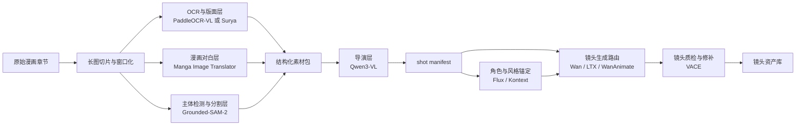

# 私有化漫画转动漫多模块工作流设计方案

这份文档是对现有剧情向多工作流方法论的进一步收敛，目标不是再讨论“应不应该拆工作流”，而是把一条可私有化部署、可逐步自动化、可按模块落地的漫画转动漫生产线定义清楚。

本文聚焦的组合如下：

- Qwen3-VL：导演层主模型
- Grounded-SAM-2：主体检测、分割、智能裁切层
- PaddleOCR-VL 或 Surya：OCR 与结构层
- Manga Image Translator：漫画对白与气泡层
- 现有本地生成栈：Wan / LTX / WanAnimate / VACE / Flux / Kontext

这套方案默认目标是纯私有化或可完全本地替代的部署路线，不把 Gemini、DINO-X API、Grounding DINO 1.5 云接口之类的在线服务作为主链依赖。

## 当前落地口径

这份文档后续应作为 `agent-projects/manga-anime-pipeline` 生成具体 ComfyUI 工作流文件和项目配置的依据，而不是只作为概念说明。

当前项目已经具备外部 pipeline 原型：长图切片、PaddleOCR provider、OCR-based Dialogue provider、lightweight detection provider、Qwen3-VL director 的 Ollama / local / OpenAI-compatible 接入、Stage 3A / 4A / 5 / 6 gate，以及 ComfyUI batch submitter。当前仍未完成的是 Grounded-SAM-2 真实检测 provider、Manga Image Translator provider、ComfyUI 自建节点包、`configs/comfy_workflows/` 下的真实 API workflow 模板，以及根据 shot manifest 覆写模板节点参数的 `template_patcher`。

因此后续工作流文件的生成顺序应以“先让最小生成 route 可提交，再逐步补分析节点和高阶 route”为原则。不要把本文理解成必须先一次性做完整 ComfyUI 节点包才能开始生成。

## 1. 目标与边界

### 核心目标

围绕长条漫画或多页漫画，构建一条能输出镜头清单和生成路由的前后端分层生产线，解决以下问题：

1. 从原始漫画中切出适合做视频的内容窗口。
2. 基于画面内容、对白、前后文理解剧情推进关系。
3. 在切分时筛掉不适合直接动画化的片段。
4. 自动生成贴合上下文的镜头提示词、连续性约束和工作流路由。
5. 把选中的镜头送入现有 ComfyUI 视频生成工作流批量执行。

### 非目标

这份设计文档不尝试解决以下问题：

1. 单个超大工作流一次性完成整章生成。
2. 一步到位做完配音、口型、字幕、BGM 和总装。
3. 依赖某一个神奇模型同时做好 OCR、剧情理解、镜头设计和视频生成。
4. 在当前文档内直接落具体部署脚本或服务代码。

### 设计原则

1. 模块分层，不追求单点全包。
2. 所有关键中间结果都可落盘、复跑、缓存和人工抽查。
3. 前处理与导演层先稳定，再追求后端生成全自动。
4. 所有模块优先支持离线、本地权重和结构化输出。

## 2. 一句话架构

先把漫画拆成连续观察窗口，再分别抽取结构信息、对白信息、视觉主体信息，最后由 Qwen3-VL 结合上下文生成 shot manifest，再把 manifest 中的镜头按类型路由到 Wan、LTX、WanAnimate、VACE、Flux/Kontext 等现有工作流执行。

## 3. 总体分层



## 4. 模块职责定义

## 4.1 长图切片与窗口化模块

### 作用

把超长 webtoon 或多页漫画转成适合模型分析的连续观察窗口，而不是一开始就强依赖传统 panel segmentation。

### 为什么必须先做这一步

1. 许多条漫没有稳定闭合 panel 边界。
2. 直接对整张超长图跑 VLM、OCR 或检测，计算量和误差都更大。
3. 先做窗口化可以保留上下文重叠，方便后面决定“切”还是“合”。

### 输入

- 原始章节目录或多页图片序列
- 每张图的原始宽高

### 输出

- 按顺序编号的窗口切片图
- 每个窗口的原始坐标范围
- 相邻窗口的重叠关系

### 关键要求

1. 保留原图坐标系，后续所有 bbox 和 crop 都要能映射回原图。
2. 窗口之间必须有重叠区域，避免角色或对白被硬切断。
3. 输出既支持 webtoon 长图，也支持普通分页漫画。

## 4.2 OCR 与结构层

### 推荐实现

- 方案 A：Surya
- 方案 B：PaddleOCR-VL 或 PaddleOCR 3.x + PP-StructureV3

### 作用

输出文字框、阅读顺序、版面区域、段落结构和粗粒度 layout 信息。

### 适合做的事

1. 提取文本框和阅读顺序。
2. 区分密集对白段、说明文字段、相对空白段。
3. 为导演层提供文本负载和版面密度特征。

### 不适合单独做的事

1. 判断剧情高潮或镜头价值。
2. 决定这个窗口是否适合直接做动画镜头。
3. 自动生成符合剧情上下文的提示词。

### 选择建议

1. 如果优先追求阅读顺序和工程接入稳定，优先 Surya。
2. 如果更看重中文和复杂结构的一体化处理，可优先 PaddleOCR-VL。
3. 后续部署时只需要先落一种，另一种保留为替换件或对照件。

## 4.3 漫画对白与气泡层

### 推荐实现

- Manga Image Translator

### 作用

对漫画特有的文本区域做补强，包括气泡文字检测、对白区域定位、去字辅助信息和对白抽取。

### 为什么不能只靠通用 OCR

漫画里的对白经常伴随：

1. 弯曲气泡或异形文本框。
2. 叠在插画上的对白。
3. 大字拟声词、特殊装饰字、对白与旁白混排。

Manga Image Translator 对这类输入通常比通用 OCR 更顺手。

### 输出建议

- bubble_boxes
- dialogue_blocks
- sfx_blocks
- cleaned_text_candidates

## 4.4 主体检测、分割与智能裁切层

### 推荐实现

- Grounded-SAM-2，使用本地 Grounding DINO + SAM2 权重

### 作用

为每个窗口生成“镜头候选视角”，包括人物、脸部、上半身、全身、道具、背景主体等可用于后续裁切的区域。

### 关键价值

这一层不是简单给 panel 框，而是帮助系统回答：

1. 这个窗口里视觉重点在哪里。
2. 适合切成特写、中景还是全景。
3. 后续提示词该强调谁、什么动作、什么物件。

### 输出建议

- object_boxes
- object_masks
- crop_candidates
- focus_subjects
- scene_density

### 部署约束

1. 默认不接 Grounding DINO 1.5 云接口。
2. 默认不接 DINO-X API。
3. 如需更稳定高分辨率推理，可保留 SAHI 切片推理能力。

## 4.5 导演层

### 推荐实现

- Qwen3-VL，本地部署或本地 Ollama 服务

当前项目优先采用 Ollama 模式接入 Qwen3-VL，让 director 模型运行在独立服务中，pipeline 只通过 HTTP 调用并要求严格 JSON 输出。只有在需要完全控制权重目录、显存分配或推理框架时，才切换到 local transformers 模式。

### 作用

这是一条生产线里最关键的模块。它不负责直接生成视频，而是负责生成结构化导演决策。

### 它要回答的问题

1. 当前窗口是剧情推进、对白、动作、反应、过渡还是说明性内容。
2. 当前窗口应独立成镜头，还是与前后窗口合并。
3. 当前窗口是否适合直接动画化。
4. 如果适合，最合适的镜头裁切和提示词是什么。
5. 这个镜头该路由到哪条生成工作流。

### 强制输出原则

导演层不能只输出自然语言描述，必须强制输出结构化 JSON。否则后面无法稳定编排。

### 推荐输出字段

- shot_id
- source_pages
- source_windows
- source_ranges
- merge_with_prev
- merge_with_next
- story_role
- shot_type
- anime_fit_score
- main_characters
- support_characters
- emotion
- action_level
- dialogue_summary
- continuity_notes
- crop_recommendation
- positive_prompt
- negative_prompt
- style_anchor
- workflow_route
- confidence

### workflow_route 建议枚举

- establish_scene
- dialogue_light_motion
- dialogue_heavy_expression
- action_performance
- transition_atmosphere
- repair_only
- skip

### anime_fit_score 建议用途

1. 低分片段直接跳过或进入人工复核队列。
2. 中分片段只做静态演出或低成本轻动。
3. 高分片段进入主生成链。

### 可选增强：导演层 API 优化位

导演层默认应以本地 Qwen3-VL 为主，不建议一开始就把导演判断完全外包给在线 API。

更稳的混合架构是：

1. draft_director：本地 Qwen3-VL 先生成 shot manifest 草稿。
2. api_refiner：可选接入 LLM 或 VLM API，只优化指定字段。
3. schema_validator：本地规则层再次校验字段合法性和可执行性。

API 优化位适合接管的字段：

- story_role
- anime_fit_score
- continuity_notes
- positive_prompt
- negative_prompt
- workflow_route
- merge_with_prev
- merge_with_next

API 优化位不应直接改写的字段：

- source_ranges
- 原始坐标
- object_boxes
- object_masks
- crop_candidates 的底层视觉事实

如果后续需要在质量和私有化之间折中，建议优先采用下面两种接法：

1. 只把结构化摘要和 manifest 草稿发给 API，不直接发原图。
2. 只对低置信度、临界 anime_fit_score 或多人复杂场景启用 API 复判。

## 4.6 角色与风格锚定层

### 推荐实现

- Flux
- Kontext
- 角色参考图与风格参考图管理

### 作用

在正式批量生成前，把角色身份、服装、发型、配色、画风锚定下来，减少跨镜头漂移。

### 典型输入

- manifest 中高置信度的人物镜头
- 手工确认的角色代表图
- 漫画原始角色参考

### 典型输出

- character_bible
- style_bible
- prompt_anchor_pack

## 4.7 生成路由层

### 作用

根据 manifest 中的 shot_type、anime_fit_score 和 workflow_route，把镜头分发到现有 ComfyUI 工作流。

### 与现有本地栈的映射建议

1. establish_scene -> LTX 或 Wan 2.2 T2V/I2V
2. dialogue_light_motion -> Wan 2.2 I2V 或轻量 LTX I2V
3. dialogue_heavy_expression -> WanAnimate 或后续对白专用工作流
4. action_performance -> WanAnimate 优先
5. transition_atmosphere -> Wan 2.2 T2V / LTX T2V
6. repair_only -> VACE

### 当前已知可直接衔接的本地技能

基于现有注册表，当前至少可与以下技能或工作流直接衔接：

- wan22_t2v_fast
- wan22_i2v_api
- ltx2_t2v_api
- ltx2_i2v_api
- wan_vace_api

WanAnimate、Flux、Kontext 等路线可在后续部署时补导出为 API 工作流，再纳入统一路由层。

## 4.8 质检与修补层

### 作用

对生成结果做最小闭环：筛出破图、人物错位、运动异常、口型不协调、连续性崩坏的镜头，并把它们送回修补链。

### 推荐职责边界

1. VACE 负责视频修补和局部修复。
2. 角色和风格明显漂移时，回退到 Flux/Kontext 重新锚定。
3. 提示词或裁切明显不对时，回退到 manifest 阶段重跑导演层。

## 5. 结构化数据流

### 5.1 原始输入对象

```json
{
  "series_id": "example_series",
  "chapter_id": "ep001",
  "input_type": "webtoon",
  "pages": [
    {
      "page_id": "p001",
      "image_path": "runtime/input/example_series/ep001/0000_ep001_p001.jpg",
      "width": 1080,
      "height": 16500
    }
  ]
}
```

### 5.2 窗口切片对象

```json
{
  "window_id": "ep001_p001_w0003",
  "page_id": "p001",
  "image_path": "runtime/windows/example_series/ep001/p001/w0003.jpg",
  "source_box": [0, 4200, 1080, 6200],
  "overlap_prev": 240,
  "overlap_next": 240
}
```

### 5.3 结构化素材包

```json
{
  "window_id": "ep001_p001_w0003",
  "ocr_blocks": [],
  "dialogue_blocks": [],
  "sfx_blocks": [],
  "object_boxes": [],
  "object_masks": [],
  "crop_candidates": [],
  "reading_order": [],
  "scene_density": 0.62
}
```

### 5.4 shot manifest 对象

```json
{
  "shot_id": "ep001_s012",
  "source_pages": ["p001"],
  "source_windows": ["ep001_p001_w0003", "ep001_p001_w0004"],
  "source_ranges": [
    {"page_id": "p001", "box": [0, 4200, 1080, 7600]}
  ],
  "story_role": "dialogue_turning_point",
  "shot_type": "dialogue",
  "anime_fit_score": 0.87,
  "main_characters": ["char_a", "char_b"],
  "emotion": "tense_confession",
  "action_level": "low",
  "dialogue_summary": "角色A在压力下坦白关键信息，角色B明显动摇。",
  "continuity_notes": [
    "保持角色A外套颜色一致",
    "角色B视线始终朝左侧"
  ],
  "crop_recommendation": {
    "type": "medium_two_shot",
    "box": [110, 4450, 980, 6450]
  },
  "positive_prompt": "anime cinematic medium two-shot, tense confession, subtle breathing, restrained body motion, dramatic eye focus, indoor dramatic lighting",
  "negative_prompt": "extra fingers, inconsistent costume, exaggerated mouth, warped face, deformed anatomy",
  "style_anchor": "series_style_v1",
  "workflow_route": "dialogue_light_motion",
  "confidence": 0.83
}
```

## 6. 模块间接口约定

为了后续能分模块部署，建议每个模块都遵守统一接口：

1. 输入使用文件路径加 JSON 元数据，而不是只走内存对象。
2. 每一步都把结果落到独立 runtime 子目录。
3. 每一步都支持重复执行和断点续跑。
4. 每一步都返回 machine-readable 状态，而不是只打印日志。

### 推荐状态字段

- task_id
- stage
- status
- started_at
- finished_at
- input_refs
- output_refs
- error_message
- retry_count

### 实际运行方式

这套方案后续不应理解成“全部模块都塞进一张超级 ComfyUI 工作流”。

更合理的使用方式是：

1. 单步推理明确、输入输出结构清楚的能力，优先封装成 ComfyUI 自建节点。
2. 按镜头类型出片的生成链，拆成多张 ComfyUI 工作流模板，而不是一张总图全包。
3. 章节级批处理、状态管理、断点续跑和人工审核，仍放在 ComfyUI 外部的编排层。

换句话说，ComfyUI 在这条链里既是生成引擎，也是模型能力容器；但它仍然不应充当整条生产线的总调度器。

### 推荐的整体形态

建议把系统拆成 3 层：

1. 自建节点层：把长图切片、OCR、对白抽取、Grounded-SAM-2、Qwen3-VL、manifest 读写、prompt 注入等能力做成自定义节点。
2. 工作流模板层：按镜头用途拆成多张 ComfyUI 图，例如分析图、导演草稿图、单镜头生成图、修补图。
3. 外部编排层：负责读取 manifest、批量投递任务、跟踪状态、重试失败镜头、归档结果和人工审核。

## 6.1 适合做成自建节点的模块

最适合放进 ComfyUI 自定义节点的，是“单步推理明确、输入输出结构清楚”的模块。

### 长图切片节点

输入原图，输出窗口切片和坐标。

### OCR 与布局节点

封装 Surya 或 PaddleOCR-VL，输出文本框、阅读顺序、结构块。

### 漫画对白节点

封装 Manga Image Translator，输出 dialogue_blocks、bubble_boxes、sfx_blocks。

### 检测与裁切候选节点

封装 Grounded-SAM-2，输出 object_boxes、object_masks、crop_candidates。

### 导演草稿节点

封装 Qwen3-VL，本地生成 shot manifest 草稿。

### API 精修节点

可选，把结构化摘要发给 LLM 或 VLM API，优化提示词和路由。

### Manifest 读写节点

负责把结构化结果存成 JSON，并能在生成图里读回单条镜头任务。

### Prompt 注入节点

把 manifest 里的 prompt、negative_prompt、seed、参考图、镜头框注入到 Wan、LTX、WanAnimate、VACE 图里。

### 节点化的边界要求

1. 每个节点都应尽量保持单一职责，不把多种模型能力混成一个黑盒节点。
2. 每个节点都应输出结构化结果，至少支持 JSON 或明确的元数据对象。
3. 每个节点都应支持落盘，方便后续断点续跑和人工抽查。
4. 节点之间尽量传递路径、结构化对象和引用，而不是只传大段自由文本。

### 哪些步骤在 ComfyUI 中

建议放在 ComfyUI 中的工作：

1. 调通和可视化验证 Wan、LTX、WanAnimate、VACE、Flux、Kontext 工作流。
2. 搭建分析图，把长图切片、OCR、对白抽取、Grounded-SAM-2、Qwen3-VL 等能力串成可复用节点图。
3. 把最终确定的分析图、导演图、生成图、修补图分别导出为 API JSON。
4. 通过 Queue Manager 观察队列、失败任务和生成结果。
5. 对个别镜头做人工调参、补跑和视觉验收。

### 哪些部分不建议硬做成节点图

这些部分最好放在 ComfyUI 外部：

1. 章节级批处理调度。
2. shot manifest 的人工审核与修改。
3. 失败任务重试和断点续跑。
4. 多镜头循环提交。
5. 结果归档、打标签、统计和质检台账。

原因很简单：这些职责更偏状态管理、任务编排和生产控制，不是单次模型推理。即使能塞进节点图，也会变得难以维护、难以复现、难以补跑。

### 推荐的分图方案

如果按本文方案在 ComfyUI 中实施，建议至少拆成下面几张图：

1. 漫画分析图：输入原始章节或窗口图，输出结构化素材包。
2. 导演草稿图：输入结构化素材包和上下文摘要，输出 shot manifest 草稿。
3. 单镜头生成图：按 workflow_route 分成 establish_scene、dialogue_light_motion、action_performance 等模板图。
4. 修补图：专门用于 VACE 修补、局部重绘和失败镜头补救。
5. 角色锚定图：用于 Flux、Kontext、角色参考图和风格锚点管理。

不要把这些职责合并成一张全能图。拆图之后，后续导出 API 工作流、排查错误和替换模块都会容易很多。

### 后续使用顺序

文档所描述的工作流后续建议按下面方式使用：

1. 准备漫画章节原图，放入 runtime/input/。
2. 在 ComfyUI 中搭好分析图，用自建节点产出 windows、structured 和 manifest 草稿。
3. 先人工抽查一版 shot manifest，确认 shot_type、anime_fit_score、workflow_route 是否基本合理。
4. 在 ComfyUI 页面中分别调通几条代表性生成工作流，例如 Wan 2.2 I2V、LTX I2V、VACE 修补。
5. 把分析图、导演图、生成图、修补图分别导出一次 API JSON。
6. 在外部编排层中建立 workflow_route 到 API 工作流的映射关系。
7. 编排器根据 manifest 逐条调用 ComfyUI 的 /prompt API 投递任务。
8. 通过 Queue Manager 查看队列和结果，必要时对失败镜头或低质量镜头补跑。
9. 质检阶段把需要修补的镜头重新送入 VACE 或回退到导演层重判。

### 对 ComfyUI 的推荐用法

后续真正使用时，建议把 ComfyUI 分成两种工作模式：

1. 设计模式：在网页界面里搭节点、调工作流、找参数、验证画面效果。
2. 生产模式：由外部编排器按 manifest 批量调用 API 工作流，ComfyUI 负责节点推理和生成执行。

第一种适合找最佳参数，第二种适合批量生产。两者不要混在一起，否则会很难复现结果。

### ComfyUI API 提交约定

后续如果按本文部署，建议所有投递到 ComfyUI 的任务都带上可识别来源，例如：

- client_id: agent:manga-pipeline|workflow:wan22_i2v|run:<短ID>
- extra_data.agent: manga-pipeline
- extra_data.workflow_name: 具体工作流名
- extra_data.source: shot_manifest
- extra_data.notes: 本次覆写的 prompt、seed、输入图、镜头 ID

这样后续在 Queue Manager 里才能看清楚每个任务对应哪个镜头和哪条路由。

## 6.2 可生成工作流文件的具体规格

本节是后续生成具体 ComfyUI 工作流文件的直接规格。后续创建、导出或自动生成工作流时，应优先满足这里的文件命名、输入输出、route 映射和 sidecar mapping 约定。

### 6.2.1 工作流文件分层与存放位置

后续会同时存在三类工作流资产：

1. 技能层已有 API 资产：放在 `agent-skills/comfyui/workflows/api/`，例如现有 Wan、LTX、VACE、Qwen Image 等导出或测试工作流。这些文件用于复用和参考，不直接等同于漫画 pipeline 的最终 route 模板。
2. 项目级 route 模板：放在 `agent-projects/manga-anime-pipeline/configs/comfy_workflows/`，由 Stage 6 按 `workflow_route` 读取并提交。这里的文件名必须和 `configs/comfy.default.json` 的映射一致。
3. ComfyUI 自建节点图：稳定后放在 `agent-projects/manga-anime-pipeline/comfyui_nodes/manga_anime_pipeline/`，安装时再同步或软链接到 `ComfyUI/custom_nodes/manga_anime_pipeline`。

Stage 6 只直接消费第二类项目级 route 模板。第一类技能层资产可以作为模板来源，第三类自建节点用于让分析和导演过程可视化，但都不应替代项目级 route 模板的命名约定。

### 6.2.2 必须生成的项目级文件

项目级最少需要下面这些文件：

```text
agent-projects/manga-anime-pipeline/configs/comfy_workflows/
  dialogue_light_motion.json
  dialogue_light_motion.mapping.json
```

完整 route 覆盖后，应具备：

```text
agent-projects/manga-anime-pipeline/configs/comfy_workflows/
  establish_scene.json
  establish_scene.mapping.json
  dialogue_light_motion.json
  dialogue_light_motion.mapping.json
  dialogue_heavy_expression.json
  dialogue_heavy_expression.mapping.json
  action_performance.json
  action_performance.mapping.json
  transition_atmosphere.json
  transition_atmosphere.mapping.json
  repair_only.json
  repair_only.mapping.json
```

其中 `.json` 必须是 ComfyUI 导出的 API workflow JSON，不是网页 UI workflow JSON。`.mapping.json` 是项目自定义 sidecar 文件，用于告诉 `template_patcher` 应该把 shot manifest 的字段写到哪些节点输入。

分析图、导演图、角色锚定图可以也导出到同一目录，但它们不属于 Stage 6 route 模板，建议使用以下名字区分：

```text
analysis_manga_structure.json
director_shot_manifest.json
character_style_anchor.json
```

### 6.2.3 通用 workflow mapping 格式

每个 route 模板都应配套一个同名 `.mapping.json`。推荐结构如下：

```json
{
  "workflow_name": "dialogue_light_motion",
  "workflow_route": "dialogue_light_motion",
  "template_version": 1,
  "base_skill": "wan22_i2v_api",
  "required_shot_fields": [
    "shot_id",
    "positive_prompt",
    "negative_prompt",
    "workflow_route",
    "crop_recommendation"
  ],
  "inputs": {
    "positive_prompt": {"node_id": "", "input": "text", "required": true},
    "negative_prompt": {"node_id": "", "input": "text", "required": true},
    "input_image": {"node_id": "", "input": "image", "required": true},
    "seed": {"node_id": "", "input": "seed", "required": false},
    "width": {"node_id": "", "input": "width", "required": false},
    "height": {"node_id": "", "input": "height", "required": false},
    "frames": {"node_id": "", "input": "length", "required": false},
    "fps": {"node_id": "", "input": "fps", "required": false},
    "output_prefix": {"node_id": "", "input": "filename_prefix", "required": true}
  },
  "defaults": {
    "width": 768,
    "height": 512,
    "frames": 81,
    "fps": 16
  }
}
```

`node_id` 在模板导出前可以留空；一旦从 ComfyUI 导出 API JSON，必须回填真实节点 ID。后续 `template_patcher` 应校验 mapping 中的节点 ID 是否存在、输入名是否存在、必填 shot 字段是否存在。校验失败时 Stage 6 应 fail，而不是提交半配置工作流。

### 6.2.4 template_patcher 的行为约定

`pipeline/comfy/template_patcher.py` 应承担下面职责：

1. 读取 route 模板 API JSON 和同名 mapping JSON。
2. 从 shot manifest 中提取 `positive_prompt`、`negative_prompt`、`crop_recommendation`、`style_anchor`、`workflow_route`、`shot_id`。
3. 根据 `crop_recommendation` 在 runtime 下准备输入图；如果已经存在 shot crop，则直接使用；如果只有原图坐标，则先裁切并落盘。
4. 如果 shot 没有 `seed`，按 `series_id + chapter_id + shot_id` 生成稳定 seed。
5. 生成 `output_prefix`，格式建议为 `<series_id>/<chapter_id>/<workflow_route>/<shot_id>`。
6. 按 mapping 覆写 API workflow 的节点输入。
7. 返回 patched workflow，并把实际覆写字段写入 ComfyUI `extra_data.notes`。

模板注入层不负责判断镜头该走哪条 route，也不负责修改导演层语义。route 决策必须在 shot manifest 阶段完成。

### 6.2.5 漫画分析图：analysis_manga_structure.json

这张图用于把漫画章节拆成结构化素材包。它适合在 ComfyUI 中做可视化调试，也可以先由外部 pipeline 脚本完成。

推荐节点链：

```text
MangaChapterLoad
  -> MangaLongImageSlice
  -> MangaOCRAnalyze
  -> MangaDialogueAnalyze
  -> MangaDetectCandidates
  -> MangaBuildStructuredPacket
```

输入：

- `chapter_json`：章节输入 JSON。
- `runtime_root`：运行产物根目录，默认 `runtime/`。
- `window_height`：长图窗口高度。
- `overlap`：相邻窗口重叠像素。
- `ocr_provider`：初期 `paddleocr`，后续可替换为 `surya` 或 `paddleocr_vl`。
- `dialogue_provider`：初期 `ocr_based`，后续替换为 `manga_image_translator`。
- `detection_provider`：初期 `lightweight`，最终替换为 `grounded_sam2`。

输出：

- `window_manifest.json`
- `structured_packets.json`
- `packets/<window_id>.json`
- `stage_status.json`

实现要求：

1. 坐标必须保留原图坐标和窗口局部坐标。
2. OCR、dialogue、detection 三个 provider 可以分别失败并写入明确错误，但不能静默返回假成功。
3. `lightweight` detection 只能标记为过渡结果，不能冒充 Grounded-SAM-2。
4. 如果使用 Grounded-SAM-2，mask 应落盘为文件或 RLE 引用，不要把巨大数组写入 JSON。

### 6.2.6 导演草稿图：director_shot_manifest.json

这张图用于消费结构化素材包，并生成 shot manifest 草稿。

推荐节点链：

```text
MangaStructuredPacketRead
  -> MangaDirectorContextBuild
  -> MangaDirectorDraft
  -> MangaShotSchemaValidate
  -> MangaManifestWrite
```

输入：

- `structured_packets_path`
- `series_id`
- `chapter_id`
- `ollama_base_url`，默认 `http://127.0.0.1:11434`
- `ollama_model`，必须和 `ollama list` 返回模型名完全一致
- `max_context_windows`，建议 3 到 5
- `schema_path`，指向项目内 shot schema

输出：

- `shot_manifest.json`
- `director_raw_responses/`
- `stage5_gate_report.json`

实现要求：

1. Qwen3-VL 必须输出严格 JSON，不允许只输出自然语言说明。
2. director 节点调用 Ollama 时，应传入窗口图或关键 crop 图，以及 OCR/dialogue/detection 摘要。
3. 每条 shot 必须通过 `SHOT_SCHEMA` 校验后才能进入 manifest。
4. `workflow_route` 必须是固定枚举之一。
5. 低置信度或 schema 修复失败的镜头应写入人工复核队列，不要直接送生成。

### 6.2.7 角色与风格锚定图：character_style_anchor.json

这张图不是 Stage 6 的硬依赖，但用于减少多镜头漂移。初期可以人工选择角色参考图；后续再自动从高分 crop 中生成角色包。

推荐输入：

- `shot_manifest.json`
- 高置信度角色 crop
- 原始漫画角色参考页
- 风格参考图

推荐输出：

- `character_bible.json`
- `style_bible.json`
- `prompt_anchor_pack.json`
- 角色参考图目录

可用生成链：

1. Flux / Kontext 用于角色和风格锚定。
2. Qwen Image Edit / Inpaint / Outpaint 用于参考图修正、补边和局部清理。
3. 角色锚定结果只作为 `style_anchor` 和参考图输入，不应回写底层视觉事实。

### 6.2.8 establish_scene.json

用途：生成场景建立、环境展示、章节开场或位置切换镜头。

推荐基底：Wan 2.2 T2V/I2V 或 LTX T2V/I2V。若 shot 有可靠 crop，可使用 I2V；如果只有剧情摘要和环境描述，可使用 T2V。

必填注入字段：

- `positive_prompt`
- `negative_prompt`
- `seed`
- `output_prefix`

可选注入字段：

- `input_image`
- `style_anchor`
- `width`
- `height`
- `frames`
- `fps`

默认画面策略：

1. 镜头运动以缓慢推进、横移、轻微环绕为主。
2. 不强调复杂人物动作，避免开场镜头引入角色漂移。
3. 如果使用原漫画 crop，优先保留场景构图和环境物件。

验收标准：

1. 输出 3 到 6 秒视频。
2. 文件名含 `shot_id`。
3. 画面主体和 `story_role` 不冲突。
4. 没有明显错误角色或错场景。

### 6.2.9 dialogue_light_motion.json

用途：生成对白、反应、轻微表情、轻微呼吸和轻镜头运动。这应作为第一条优先落地的最小生成链。

推荐基底：Wan 2.2 I2V 或 LTX I2V。现有技能注册表中的 `wan22_i2v_api`、`ltx2_i2v_api` 可作为导出和参数参考，但项目模板仍需保存为 `configs/comfy_workflows/dialogue_light_motion.json`。

推荐节点链：

```text
MangaManifestReadShot 或 template_patcher 输入
  -> LoadImage(crop)
  -> PositivePromptEncode
  -> NegativePromptEncode
  -> Wan/LTX I2V Sampler
  -> VideoDecode
  -> SaveVideo(output_prefix)
```

必填注入字段：

- `input_image`
- `positive_prompt`
- `negative_prompt`
- `seed`
- `output_prefix`

默认参数建议：

- `frames`: 81
- `fps`: 16
- `width` / `height`: 先以 768x512 或 512x768 做首轮验证，再根据显存调整
- 运动强度：低
- prompt 应强调 subtle breathing、small head motion、eye focus、restrained body motion

验收标准：

1. 人物身份和服装不明显漂移。
2. 嘴部不要大幅乱动，除非后续接专门口型链。
3. 背景和原始 crop 的空间关系基本一致。
4. 作为 Stage 6 第一条链路时，必须能被 `run_stage6_gate.py` 提交并记录 `prompt_id`。

### 6.2.10 dialogue_heavy_expression.json

用途：生成强表情对白、情绪爆发、哭喊、震惊、愤怒等表演镜头。

推荐基底：WanAnimate 或后续 talking/lipsync 工作流。当前如果 WanAnimate 模板尚未生产化，可以临时复制 `dialogue_light_motion` 的结构作为 fallback，但 mapping 中必须标记 `fallback_to: dialogue_light_motion`，避免误以为已经具备强表情链。

必填注入字段：

- `input_image`
- `positive_prompt`
- `negative_prompt`
- `seed`
- `output_prefix`

推荐增强输入：

- `character_reference_image`
- `face_crop`
- `emotion_label`
- `audio_path`，如果后续接口型或配音

默认画面策略：

1. 镜头以脸部、半身、眼神和表情变化为主。
2. 动作幅度中等，不要同时要求复杂肢体动作。
3. 角色锚定权重应高于背景自由发挥。

验收标准：

1. 表情变化能匹配 `emotion` 和 `dialogue_summary`。
2. 面部结构不崩坏。
3. 不能因为强表情导致角色发型、服装和年龄漂移。

### 6.2.11 action_performance.json

用途：生成战斗、奔跑、转身、伸手、拥抱、摔倒等动作镜头。

推荐基底：WanAnimate、LTX Pose-to-Video 或带动作参考的 I2V 工作流。现有技能注册表中的 `ltx2_pose_to_video_api` 和 `agent-skills/comfyui/workflows/api/wan22_animate_pose_compat_test.json` 可作为参考，但生产模板必须重新整理成项目 route 模板。

必填注入字段：

- `input_image`
- `positive_prompt`
- `negative_prompt`
- `seed`
- `output_prefix`

推荐增强输入：

- `pose_image`
- `action_reference_video`
- `character_reference_image`
- `motion_strength`

默认画面策略：

1. 对动作镜头优先使用中景或全身 crop。
2. 如果没有 pose 或动作参考，不要让 prompt 要求过复杂的连续动作。
3. 高动作镜头失败率较高，应默认进入更严格质检。

验收标准：

1. 肢体结构可接受，无严重多手多腿。
2. 动作方向与 `continuity_notes` 不冲突。
3. 主体没有离开画面或被裁掉关键动作。

### 6.2.12 transition_atmosphere.json

用途：生成空镜、氛围、情绪铺垫、章节内转场。

推荐基底：Wan 2.2 T2V、LTX T2V，或有背景 crop 时使用 I2V。

必填注入字段：

- `positive_prompt`
- `negative_prompt`
- `seed`
- `output_prefix`

可选注入字段：

- `input_image`
- `style_anchor`
- `color_mood`

默认画面策略：

1. 尽量减少具体人物，避免凭空生成错误角色。
2. 强调光影、环境、天气、物件和镜头节奏。
3. 可作为两段剧情之间的缓冲镜头。

验收标准：

1. 情绪和上下文一致。
2. 不引入剧情上不存在的新角色或关键物件。
3. 可以自然衔接前后 shot。

### 6.2.13 repair_only.json

用途：对已经生成的视频或图像做修补、延长、局部重绘、遮罩修复。

推荐基底：Wan VACE。现有技能注册表中的 `wan_vace_api` 是主要参考。

必填注入字段：

- `source_video` 或 `source_image`
- `mask_image`
- `positive_prompt`
- `negative_prompt`
- `seed`
- `output_prefix`

推荐增强输入：

- `repair_reason`
- `failed_output_path`
- `source_shot_id`

默认修补策略：

1. 小范围面部或手部错误优先局部 mask。
2. 构图和运动整体失败时，不走 repair_only，应回退到原 route 重新生成。
3. 角色身份漂移严重时，优先回到角色锚定或导演层重判。

验收标准：

1. 修补后区域与周围画面无明显接缝。
2. 修补不能改变镜头语义。
3. 输出记录要保留原失败文件路径和修补原因。

### 6.2.14 route 模板生成顺序

推荐按下面顺序生成实际工作流文件：

1. 先生成 `dialogue_light_motion.json` 和 `dialogue_light_motion.mapping.json`，跑通最小 I2V 链。
2. 实现 `template_patcher.py`，确保 prompt、输入图、seed、output_prefix 能自动注入。
3. 用一条真实 shot 运行 Stage 6 gate，确认 ComfyUI 能返回 `prompt_id`，Queue Manager 中能看见可识别 `client_id`。
4. 生成 `establish_scene.json` 和 `transition_atmosphere.json`，补齐 T2V / 氛围镜头。
5. 生成 `repair_only.json`，让失败镜头有 VACE 修补入口。
6. 最后生成 `dialogue_heavy_expression.json` 和 `action_performance.json`，再接 WanAnimate、pose 或口型相关依赖。

当前 ComfyUI 如果正在跑其他工作流，不要在这个阶段提交 Stage 6 任务；只做模板文件、mapping 文件和静态校验即可。

## 7. 推荐目录规划

文档本身放在 agent-skills/docs/，但如果后续真的部署成独立项目，建议把源码主仓放到 agent-projects/ 下，并把 ComfyUI 自建节点作为其中一个子模块维护，而不是一开始直接散落开发在 ComfyUI/custom_nodes/ 里。

推荐结构例如：

```text
agent-projects/manga-anime-pipeline/
  README.md
  pyproject.toml 或 requirements.txt
  docs/
  configs/
    stage1.full.director.json
    comfy.default.json
    comfy_workflows/
      dialogue_light_motion.json
      dialogue_light_motion.mapping.json
      establish_scene.json
      establish_scene.mapping.json
  runtime/
    input/
    windows/
    structured/
    manifests/
    renders/
    qc/
  comfyui_nodes/
    manga_anime_pipeline/
      __init__.py
      nodes.py
      adapters/
  pipeline/
    ingest/
    ocr/
    dialogue/
    detection/
    director/
    comfy/
    qc/
  scripts/
```

其中：

1. `configs/comfy_workflows/` 负责保存 Stage 6 可提交的项目级 API workflow 模板和 mapping。
2. `comfyui_nodes/manga_anime_pipeline/` 负责维护自建节点源码。
3. `pipeline/` 负责核心逻辑、外部编排、状态管理、批处理调度和质检闭环。
4. 当节点稳定后，再按部署需要打包或同步到 `ComfyUI/custom_nodes/manga_anime_pipeline/`。

## 8. 分阶段部署建议

当前项目已经不是从零开始。它已经完成外部 pipeline 原型和多个 gate 脚本，因此下面的阶段应理解为“从当前状态继续推进”的顺序。

### 阶段 0：已完成的外部原型基础

当前已经具备：

1. 漫画章节输入 JSON。
2. 长图切片与窗口 manifest。
3. PaddleOCR provider。
4. OCR-based Dialogue provider。
5. lightweight detection provider。
6. Qwen3-VL director provider，推荐 Ollama 模式。
7. shot manifest schema 和写入校验。
8. Stage 3A / 4A / 5 / 6 gate。
9. ComfyUI route submitter 框架。

这一阶段的限制也很明确：Stage 6 模板还不存在，submitter 还不会自动注入 prompt / seed / 输入图，detection 还不是 Grounded-SAM-2，自建节点也还没落地。

### 阶段 1：最小可跑通版本

目标：先跑通一条真实 Stage 6 生成链，让 `shot_manifest.json -> route -> patched ComfyUI workflow -> prompt_id` 闭环成立。

建议优先完成：

1. `dialogue_light_motion.json`
2. `dialogue_light_motion.mapping.json`
3. `pipeline/comfy/template_patcher.py`
4. `submitter.py` 接入模板注入层
5. Stage 6 gate 静态校验和小样本提交

这一阶段先不追求全 route 覆盖，只验证：

1. route 能否正确找到模板。
2. mapping 能否定位真实节点。
3. prompt、negative_prompt、input_image、seed、output_prefix 能否被覆写。
4. ComfyUI 队列中能否看到带 shot_id 的任务。
5. 输出文件能否回溯到原始 shot。

### 阶段 2：接入最小生成链

目标：把最小生成链扩展成基础 route 集，覆盖对白、场景、转场和修补。

建议先接：

1. `establish_scene.json`
2. `transition_atmosphere.json`
3. `repair_only.json`
4. 对应 `.mapping.json`
5. `configs/comfy.default.json` route 映射复核
6. Stage 6 gate 对 skip、template missing、submit fail 的报告复核

先不追求动作和强表情，只验证 route 覆盖、输出命名、失败修补入口和基本镜头质量闭环。

### 阶段 3：补角色锚定和动作分流

目标：补齐高风险镜头 route，并开始降低多镜头角色漂移。

建议补：

1. `character_style_anchor.json`
2. `dialogue_heavy_expression.json`
3. `action_performance.json`
4. WanAnimate、pose 或动作参考链
5. 简单质检与补跑策略
6. API 精修节点或对应外部优化位

这一阶段之后，才建议把 Grounded-SAM-2、Manga Image Translator 和自建节点包作为提高分析质量和画布可操作性的重点任务并行推进。

### 阶段 4：补对白、口型、音频后期

目标：把这条链从“镜头生成系统”扩展到“片段级内容生产系统”。

这一阶段再引入：

1. TTS
2. lipsync
3. BGM
4. 混音与总装

## 9. 核心风险与规避策略

### 风险 1：把 OCR 当成导演层

表现：结构识别结果不错，但切镜和提示词依然很差。

规避：明确把 OCR 仅作为输入事实层，不让它承担语义决策。

### 风险 2：Grounded-SAM-2 只做检测，不做镜头候选

表现：拿到一堆框，但无法形成可用镜头。

规避：检测输出必须转成 crop_candidates，再交导演层判断。

### 风险 3：Qwen3-VL 自由发挥，不输出结构化结果

表现：内容分析看起来聪明，但无法稳定编排和复跑。

规避：强制 JSON schema，必要时加字段校验和自动重试。

### 风险 4：过早接太多生成工作流

表现：系统复杂度暴涨，但 shot manifest 质量还不稳定。

规避：先把“识别 -> manifest -> 路由”跑稳，再逐步接生成链。

## 10. 与现有文档的关系

这份文档和现有文档的分工如下：

1. [2026-04-22_剧情连贯视频多工作流逻辑归纳.md](./2026-04-22_%E5%89%A7%E6%83%85%E8%BF%9E%E8%B4%AF%E8%A7%86%E9%A2%91%E5%A4%9A%E5%B7%A5%E4%BD%9C%E6%B5%81%E9%80%BB%E8%BE%91%E5%BD%92%E7%BA%B3.md) 负责解释为什么剧情视频应拆成多工作流。
2. 本文负责定义一条面向漫画输入、强调私有化部署的前处理与导演层架构。
3. 后续如果正式开始部署，建议在 agent-projects/ 下建立独立项目，并把本文当作实施蓝图。

## 11. 后续部署顺序建议

下一轮新对话如果要真正落地，推荐按以下顺序推进：

1. 先实现 `pipeline/comfy/template_patcher.py` 和 `.mapping.json` 校验。
2. 先生成 `configs/comfy_workflows/dialogue_light_motion.json` 和对应 mapping，接 Wan 2.2 I2V 或 LTX I2V。
3. 修改 Stage 6 submitter，让它提交 patched workflow，而不是直接提交原模板。
4. 用一条小样本 shot 验证 `shot_manifest -> patched workflow -> ComfyUI prompt_id -> comfy_tasks.json`。
5. 再生成 `establish_scene.json`、`transition_atmosphere.json` 和 `repair_only.json`。
6. 再补 Grounded-SAM-2 provider，把 lightweight detection 替换为真实主体框、mask 和 crop candidates。
7. 再补 Manga Image Translator provider，提高对白和气泡结构质量。
8. 再开发 `comfyui_nodes/manga_anime_pipeline/` 自建节点包，把稳定的 pipeline 能力暴露到 ComfyUI 画布。
9. 然后生成 `dialogue_heavy_expression.json`、`action_performance.json`、角色锚定图和 API 精修位。
10. 最后接对白、口型、音频和更完整的质检闭环。

只要前三步稳定，后面的生成链和编排链就可以在独立对话中逐条接上，不需要一次把全系统铺满。