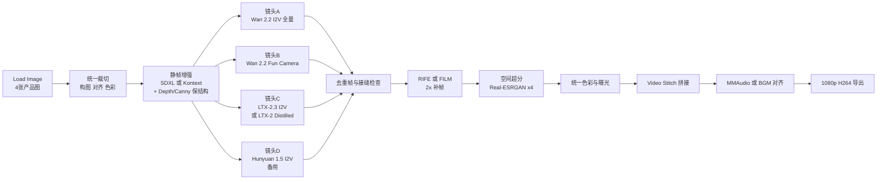

# ComfyUI 产品图优化与展示视频交接报告

> 日期：2026-05-26  
> 素材：`ComfyUI\input\产品图\` 下 4 张 ChatGPT 生成的产品图  
> 目标：先生成高质量广告主视觉，再制作有光影、镜头语言与叙事感的产品展示视频

---

## 零、本轮交接摘要（新对话先读）

本报告最初围绕视频排障撰写；本节记录 2026-05-26 与用户进一步确认后的产品图优化结论，若与下方早期建议冲突，以本节和末尾“本轮实测与资源记录”为准。

### 0.1 用户最终目标与硬约束

- 最初任务是优化速卖通商品图，并进一步生成有趣、有意义、有广告质感的视频。
- 产品为方块/积木风玩具套装。用户接受创意主视觉中更丰富的背景、人物之间更有叙事性的关系、电影级光影与更强的镜头构图。
- 视频中不要求积木主体主动运动；应优先让镜头、景深、环境粒子、雾气和光影产生动态，避免角色或积木结构被视频模型随意改写。
- 用户明确要求：**先发挥本机性能测试出可实用、质量尽可能高的方案，再考虑租用云算力运行同路线更大或更高精度模型。** 本地不得仅为速度方便而随意降质；云端增强也不得替代本机路线验证阶段。
- 必须区分两类结果：创意广告主视觉可以重构美术场景；真实商品/包装/配件信息必须由原始商品图或严格验收素材作为收尾依据。

### 0.2 关键纠偏结论

- 最初效果差的主要原因是路线选错：曾使用“抠出原商品前景 + 生成独立背景 + 合成”的保守方案，导致光影、接触阴影、透视和构图割裂。
- `Wan 2.2 I2V` 用于直接改商品静帧或让完整主视觉产生动态，会在中后帧擅自移动人物和改变套装细节，不适合作为“主体必须稳定”的核心方法。
- ChatGPT 生成的四张图属于完整广告场景重绘，主体与背景在同一个生成过程中统一了镜头、阳光、反射、景深和接触关系；因此显著强于粘贴式合成。文件没有可验证的模型元数据，不能断言具体网页端模型版本。
- 本地并非不能提高质量：补测 `Flux.1 Kontext Dev FP8` 后，原始白底商品图已能生成统一地面、夕阳、阴影和环境的主视觉，明显优于早期合成路线；仍需要更强编辑模型与构图策略继续追赶网页端效果。

### 0.3 当前应采用的制作方向

1. 静态创意主视觉先行：对原始商品图使用高质量图像编辑模型，生成统一世界观下的多张 key visual。
2. 本机质量路线优先比较：已跑通的 `Flux.1 Kontext FP8` 与适配 16GB 显存候选的 `Flux.2 Klein 4B`，并单独评估 SDXL + 风格 LoRA 创意分支；仅在本机验证方向有效后，再安排 `Qwen-Image-Edit-2511` 等同类大模型的云端放大测试。
3. SDXL 乐高/塑料玩具 LoRA 仅用于另一条“创意候选图生成”路线；它们不能直接加载到 `Flux Kontext` 或 `Qwen Image Edit` 上。
4. 视频阶段优先采用锁定优秀静帧内容的确定性镜头运动和后期光效；若使用生成式视频模型，必须先在本机以逐帧主体稳定性检查验证路线，再考虑云端同路线增强。
5. 交付前保留原始商品图/包装图的真实性确认镜头。

### 0.4 实际运行环境修正

当前 ComfyUI 服务 `/system_stats` 在 2026-05-26 实际报告：

| 环境 | 实际值 |
|------|--------|
| ComfyUI | `0.20.1` |
| Python | `3.13.11` |
| PyTorch | `2.9.1+cu130` |
| GPU | `NVIDIA GeForce RTX 5070 Ti`，约 16 GB VRAM |

下文中早期写到的 `RTX 4080` 来自工作区历史说明，不应再作为本轮实际设备判断依据。本机测试必须围绕 `RTX 5070 Ti 16GB` 的实际可运行上限展开；当本机路线已证明有效后，可用云端同系大模型提高质量上限。

---

## 一、执行摘要

当前最可能**不是"缺模型"**，而是以下几类问题的组合：

1. **工作流与模型/节点版本不一致** — Wan 2.2、LTX 2.x、HunyuanVideo 在 2025–2026 年持续快速更新，ComfyUI 版本落后会导致模板缺失、节点不兼容。
2. **4-step 加速 LoRA 被当成最终交付流程** — LightX2V 4-step LoRA 目标是快，不是最终极致运动质量；官方明确写了"可能导致动态损失"。
3. **静态产品图直接 I2V** — 白底/纯产品图让模型必须同时发明背景、镜头运动、体积光和反射，高概率造成灯光漂移、背景乱跳、结构变形。
4. **后处理链缺失** — 没有做可靠的补帧、空间超分、色彩统一和音画对齐，输出停留在"能动起来"而不是"像产品片"。

从"近 18 个月、可本地、效果已被官方/主流开源项目验证"的角度，优先考虑三条主线：

| 策略 | 主线 | 说明 |
|------|------|------|
| 质量优先 | Wan 2.2 全量 I2V / Fun Camera / Fun Control | 不用 4-step LoRA 做最终成片 |
| 稳定可控优先 | LTX-2.3 或 LTX-2.x 两阶段流程 | 配合 IC-LoRA 做深度/边缘/运动轨迹控制 |
| 资源折中优先 | HunyuanVideo 1.5 step-distilled I2V | 或 Wan2.2 TI2V-5B、LTX 2B/Q8、CogVideoX-5B-I2V |

**最稳做法是"分镜式短镜头生成"**：先把每张产品图做成 2–4 秒的高一致性 hero shot，再补帧、超分、拼接，最后加音频。短镜头 + 剪辑通常比单段长视频生成更可靠。

---

## 二、现状判断

### 已确认资产

| 类别 | 状态 |
|------|------|
| 产品图 | ✅ 4 张已在 `ComfyUI\input\产品图\` |
| Wan 2.2 I2V 14B 扩散模型 | ✅ high_noise + low_noise fp8_scaled |
| Lightx2v 4-step LoRA | ✅ high_noise + low_noise |
| Wan VAE | ✅ `wan_2.1_vae.safetensors` |
| Wan Text Encoder | ✅ `umt5_xxl_fp8_e4m3fn_scaled.safetensors` |
| Wan 2.2 源蓝图 | ✅ `ComfyUI/blueprints/Image to Video (Wan 2.2).json` |
| LTX 2.0 / 2.3 蓝图 | ✅ 多个控制视频蓝图可用 |
| 后处理 | ✅ Frame Interpolation / VFI / 4x 超分 / MMAudio |
| Kontext 风格 LoRA | ✅ 多个可用于静帧风格化预处理 |

### 本机环境

| 环境 | 版本 |
|------|------|
| GPU | NVIDIA GeForce RTX 5070 Ti（约 16GB VRAM，按 `/system_stats` 实测） |
| Python | 3.13.11 (64-bit, MSC v.1944) |
| PyTorch | 2.9.1+cu130 |
| CUDA | 13.0 |
| Node.js | v22.14.0 |
| 模型根目录 | `D:/ComfyUI-aki-v3/ComfyUI/models` |
| 自动化入口 | `D:/ComfyUI-aki-v3/.venv/Scripts/python.exe` |

> **注意**：当前本地 16GB VRAM 适合进行部分路线的诊断与对照测试；任何降低精度、分辨率或动态质量的配置都不得直接作为质量优先的最终交付，最终不足时转云 GPU。

---

## 三、高概率根因排序

| 根因类别 | 概率 | 为什么会发生 | 直接后果 |
|----------|------|-------------|----------|
| ComfyUI 版本过旧或节点导入失败 | 很高 | 视频模板与核心节点更新快 | 缺节点、模板不可用、行为异常 |
| 模型/LoRA/蓝图不匹配 | 很高 | Wan 2.2 高噪/低噪、I2V/Fun Camera/Fun Control、LoRA 强绑定 | 动作差、画面灰、直接报错 |
| 用 4-step 加速 LoRA 当最终交付 | 很高 | LightX2V 目标是快不是极致运动 | 镜头动态弱、灯光过渡生硬 |
| 静态白底/纯产品图直接 I2V | 很高 | 模型必须同时补背景、运动、光影 | 主体漂移、背景跳变、亮度闪烁 |
| 缺少补帧/超分/调色后处理 | 很高 | 原生成视频不够"商业片质感" | 卡顿、软、噪、色漂 |
| PyTorch/CUDA/cuDNN/驱动组合不理想 | 中高 | 视频节点大量依赖新 CUDA/驱动 | 极慢、OOM、节点 import failed |
| ffmpeg / VHS 配置不完整 | 中等 | VideoHelperSuite 对 ffmpeg 依赖明显 | 只能导 gif/webp、无 h264/mp4 |
| 音频同步链设计不当 | 中等 | 生成视频与后配音频时间轴脱节 | 节奏点对不上 |

### 关键说明

- **4-step LoRA 问题**：官方 Wan2.2 Fun Control 文档明确写了"使用 LightX2V 的 4 步 LoRA，速度会显著变快，但**可能导致视频动态有损失**"。4090D 测试：640×640、81 帧 fp8 全量约 520 秒，加速 LoRA 版 79–138 秒。产品片最吃镜头语言、光线过渡和平滑运动，4-step 很容易先牺牲这些维度。
- **LTX 版本差异**：LTX-2.3 相比 LTX-2.0 在细节、竖屏支持、音频、I2V 一致性、提示词理解、文字渲染方面都有显著改进。
- **HunyuanVideo 首帧一致性 bug**：官方模型卡 2025-03-07 修过一个会导致首帧身份变化的问题，确认使用修复后的新权重。

---

## 四、本地诊断

### 4.1 必跑命令

```powershell
# 1. GPU 与驱动状态
nvidia-smi

# 2. ffmpeg 可用性
ffmpeg -version

# 3. PyTorch / CUDA / cuDNN 链路检查
& d:\ComfyUI-aki-v3\.venv\Scripts\python.exe -c "import torch; print('torch=', torch.__version__); print('cuda=', torch.version.cuda); print('cudnn=', torch.backends.cudnn.version()); print('cuda_available=', torch.cuda.is_available()); print('gpu=', torch.cuda.get_device_name(0) if torch.cuda.is_available() else 'CPU')"

# 4. ComfyUI 版本
git -C d:\ComfyUI-aki-v3\ComfyUI rev-parse --short HEAD
git -C d:\ComfyUI-aki-v3\ComfyUI log --oneline -3

# 5. 自定义节点冲突排查（禁用所有节点启动）
& d:\ComfyUI-aki-v3\python\python.exe d:\ComfyUI-aki-v3\ComfyUI\main.py --disable-all-custom-nodes

# 6. 低显存模式测试（如第 5 步正常但正常模式 OOM）
& d:\ComfyUI-aki-v3\python\python.exe d:\ComfyUI-aki-v3\ComfyUI\main.py --disable-all-custom-nodes --lowvram
```

### 4.2 如何解读结果

| 检查项 | 正常结果 | 异常表现 | 修正方向 |
|--------|----------|----------|----------|
| `torch.cuda.is_available()` | `True` | `False` | PyTorch/CUDA/驱动链路未正确配置 |
| `gpu=` | `NVIDIA GeForce RTX 5070 Ti`（当前实测） | `CPU` 或非预期设备 | 重新探测当前设备或排查 PyTorch CUDA 链路 |
| `nvidia-smi` 驱动分支 | R580+ | 更旧 | 更新显卡驱动（CUDA 13.x 要求 R580+） |
| `ffmpeg -version` | 正常输出版本号 | 命令不存在 | 安装 ffmpeg 并加入 PATH |
| `git rev-parse` | 明确的 commit hash | 报错 | 确认 ComfyUI 目录完整性 |
| `--disable-all-custom-nodes` 后问题消失 | — | — | 自定义节点冲突，用二分法定位 |
| `--lowvram` 后能跑但质量下降 | — | — | 正常现象，应优化显存而非依赖 lowvram |

### 4.3 VRAM 调优参数

当前本地约 16GB VRAM 在保持实用质量前提下可用于运行与调优的手段：

```powershell
# 预留显存给系统
--reserve-vram 0.5

# 强制 fp16（部分节点）
--force-fp16

# LRU 缓存减少重复加载
--cache-lru

# 限制 RAM 缓存
--cache-ram 2
```

> `lowvram`、`novram` 和 `cpu` 仅用于排障或预览；可能影响质量的模式不得作为质量优先的最终配置，最终应切换到足够算力环境。

---

## 五、推荐成片流程

### 5.1 整体流水线



### 5.2 建议分镜时间线

```mermaid
gantt
    title 20 秒商品展示建议时间线
    dateFormat  X
    axisFormat %Ss
    section Shot
    开场 Hero 推近          :a1, 0, 4s
    低机位 侧向运动          :a2, 4, 4s
    局部特写 材质与细节      :a3, 8, 3s
    场景交代 包装与主体      :a4, 11, 4s
    收尾 卖点与 LOGO         :a5, 15, 5s
```



### 5.3 分镜策略

| 镜头 | 时长 | 运动 | 用途 |
|------|------|------|------|
| A 开场 Hero | 3–4s | dolly in | 产品全貌、建立视觉 |
| B 低机位侧向 | 3–4s | pan left/right | 展示侧面结构 |
| C 结构特写 | 2–3s | 轻微推进 | 突出材质与细节 |
| D 场景交代 | 3–4s | 缓慢拉远 | 展示整体环境 |
| E 收尾卖点 | 4–5s | 稳定居中 | LOGO / 核心卖点 |

> **关键策略**：不要"一张图直接拉 20 秒"，每张图做 2–4 秒高一致性短镜头，再拼接。

---

## 六、具体参数建议

### 6.1 Wan 2.2 主线

基于 ComfyUI 内置 `WanImageToVideo` 节点：

| 参数 | 推荐值 | 说明 |
|------|--------|------|
| 分辨率 | 832×480 | 官方默认值 |
| 帧数 | 49–81 | 49 帧 ≈ 3–4s，81 帧 ≈ 5–6s（@16fps） |
| batch | 1 | 单镜头 |
| 模型 | `wan2.2_i2v_high_noise_14B_fp8_scaled` | 最终交付用全量 |
| VAE | `wan_2.1_vae` | — |
| Text Encoder | `umt5_xxl_fp8_e4m3fn_scaled` | — |

**重要**：最终交付镜头**不要**启用 4-step LoRA。4-step 只用于快速预览找镜头节奏，选中后切回全量模型重算。

**镜头语言建议**（适合产品片）：
- `dolly in` / `dolly out` — 推近/拉远
- `pan left` / `pan right` — 水平摇移
- `jib up` / `jib down` — 垂直升降
- `arc` — 环绕
- 避免剧烈运动，产品片以微动为主

### 6.2 LTX 备用线

| 版本 | 参数 | 说明 |
|------|------|------|
| LTX-2.3 | `ltx-2.3-22b-dev` 或 `ltx-2.3-22b-dev-fp8` | 最新、细节最好、I2V 一致性最强 |
| LTX-2.3 上采样 | `ltx-2.3-spatial-upscaler-x2` | 原生空间 2x 上采样 |
| LTX-2.0 蒸馏 | 蒸馏版 8 步，CFG=1 | 速度与控制折中 |

LTX 系列优势：多关键帧、IC-LoRA 控制、空间/时间上采样、两阶段流程。适合需要更稳定产品主体、可预测镜头运动的场景。

### 6.3 HunyuanVideo 1.5 备用线

| 参数 | 值 | 说明 |
|------|------|------|
| 模型 | HunyuanVideo-1.5 step-distilled I2V | 面向 24GB 消费级 GPU |
| 推荐步数 | 8 或 12 steps | 4090 约 75 秒 |
| 显存需求 | 24GB | 当前本地 16GB 仅适合诊断候选；高质量输出应使用可承载的云 GPU |

> 当前本地运行 HunyuanVideo 1.5 可能有显存压力；如果其实测质量优于其他路线，应在云端作为正式候选运行，不因本地承载能力降级淘汰。

---

## 七、静帧预处理策略

### 7.1 为什么要统一静帧

产品图如果是白底/纯色背景，I2V 模型需要同时发明背景、运动、光影，容易失控。**最聪明的做法**：

1. 先对 4 张图做**统一静帧风格化/场景化处理**（背景、光线、色温、镜头焦段一致）
2. 然后分别做 I2V

这样视频模型面对的是"已属于同一世界观的 4 张 key visuals"，而不是 4 张风格互相打架的白底产品图。

### 7.2 可用的 Kontext 风格 LoRA

| LoRA | 效果 |
|------|------|
| `ZOEY-kontext-万物毛毡风` | 毛毡质感 |
| `ZOEY-kontext-万物水彩漫画` | 水彩漫画 |
| `ZOEY-kontext-万物现代创意插画` | 创意插画 |
| `ZOEY-kontext-万物皮克斯风格` | 皮克斯风格 |
| `萌熊Bear_3D黏土风格` | 3D 黏土 |
| `萌熊Bear_磨砂质感公仔` | 磨砂质感 |
| `萌熊Bear_胡桃木风格` | 胡桃木纹理 |
| `非遗剪纸F.1_Kontext` | 剪纸风格 |
| `水墨风工笔画` | 水墨工笔 |

### 7.3 结构保持手段

在风格化的同时保持产品结构不变：
- 使用 **Depth / Canny ControlNet** 约束边缘和深度
- 使用 **IP-Adapter** 保持产品外观相似度
- 使用较低的 denoise strength（0.3–0.5）做风格化而非重绘

---

## 八、提示词模板

### 8.1 主提示词模板

```
一套 LEGO 风格积木产品展示镜头，主体积木结构保持完全一致，砖块边缘清晰，
塑料质感真实，表面微弱高光，电影级布光，丰富但不杂乱的背景，浅景深，
轻微空气透视，商业广告摄影，主体始终居中或三分法构图，镜头稳定，画面高级，
色彩统一，背景与光影围绕产品服务，不改变产品结构，不新增无关部件
```

### 8.2 分镜提示词

**镜头 A — 开场 Hero**

```
产品放置在带有 Minecraft 风格环境暗示的展台上，前景有少量虚化植物与体积光，
镜头缓慢 dolly in，清晨暖色边缘光，主体保持绝对稳定，背景层次丰富但不过度抢眼，
像高端玩具广告开场镜头
```

**镜头 B — 低机位侧向运动**

```
低机位看向积木主体，镜头缓慢从左向右移动，背景是经过美术化处理的方块场景，
侧后方轮廓光突出砖块层级，产品轮廓清晰，结构与颜色不变化，移动轻柔，
有商业片镜头语言
```

**镜头 C — 结构特写**

```
中近景特写积木屋顶、塔楼、角色与主体细节，镜头轻微推进，景深浅，
亮面高光受控，塑料纹理与积木颗粒清晰，局部对比增强，背景虚化但保留环境色块
```

**镜头 D — 收尾卖点镜头**

```
镜头缓慢拉远，主体完整呈现，背景出现柔和光束和环境层次，整体布光更戏剧化，
像电商主视觉收尾镜头，画面整洁，主体结构与比例完全稳定
```

### 8.3 负提示词

```
主体结构改变，砖块数量变化，模型融化，塔楼倾斜，部件错位，颜色漂移，
忽明忽暗，灯光闪烁，背景抖动，镜头抽搐，塑料材质消失，文字乱码，重复角色，
多余配件，边缘撕裂，接缝，鬼影，重影，低清晰度，噪点块状化
```

---

## 九、后处理链

### 9.1 补帧

| 工具 | 说明 | 推荐场景 |
|------|------|----------|
| RIFE 4.22.lite | 官方推荐用于 diffusion 视频后处理 | 默认首选 |
| FILM | 大运动场景补帧更稳 | 运动幅度大时 |
| ComfyUI-VFI | 支持 RIFE / FILM / GMFSS / AMT / MoMo | ComfyUI 内集成 |

**策略**：先生成 12–16fps 的高稳镜头，再补到 24/30fps。比直接追求高 fps 原生生成更稳。

### 9.2 超分

| 模型 | 适用场景 |
|------|----------|
| `RealESRGAN_x4plus` | 通用 4x 超分 |
| `realesr-general-x4v3` | 通用场景，偏锐利 |
| `RealESRGAN_x4plus_anime_6B` | 动画/卡通风格 |
| LTX-2.3 spatial upscaler x2 | LTX 流程原生集成 |

> 对产品片建议在 `realesr-general-x4v3` 和 `x4plus_anime_6B` 之间做 A/B 测试。

### 9.3 音频

| 工具 | 用途 |
|------|------|
| MMAudio | 视频到音频生成，自动同步音效/BGM |
| ACE-Step 1.5 | 文本到音乐生成 |
| 外部 BGM | 手动对齐节奏点 |

---

## 十、验证清单

### 10.1 必检项

| 检查项目 | 通过标准 | 失败表现 | 修正方向 |
|----------|----------|----------|----------|
| 首帧忠实度 | 产品结构、颜色、比例与原图一致 | 砖块位置变、包装/贴纸乱 | 回退到更强结构控制，缩短镜头 |
| 中段稳定性 | 光线变化自然，背景不乱跳 | 曝光波动、背景闪、角色漂 | 减少运动幅度，换全量模型，统一静帧 |
| 末帧完整度 | 结构没塌，没有新生杂物 | 局部融化、边缘撕裂 | 缩短长度，改用分镜剪辑 |
| 补帧自然度 | 运动顺滑，无鬼影 | 重影、重复帧、边缘拉丝 | 改 RIFE/FILM 设置，先去重帧 |
| 超分可用度 | 砖块接缝更清楚，材质没蜡化 | 文字/边缘过锐或糊化 | 切换 Real-ESRGAN 模型与降噪微调 |
| 音画同步 | 节奏点能落在镜头动作上 | 迟到/早到 | 重新切点，必要时用 MMAudio |

### 10.2 三组验证样本

| 组别 | 测试内容 | 目的 |
|------|----------|------|
| 第一组 | 静态忠实度测试（几乎不做运动） | 验证主体会不会变形 |
| 第二组 | 轻微推拉测试 | 检查光线/背景会不会漂 |
| 第三组 | 最终成片测试（补帧 + 超分 + BGM） | 看整体是否像广告片 |

### 10.3 应保留的证据包

| 内容 | 用途 |
|------|------|
| Server Config 页面截图 | 看 VRAM mode、Reserved VRAM、Preview 方法 |
| 工作流全图 | 看节点结构 |
| Load Diffusion Model / LoRA / CLIP / VAE 节点截图 | 确认实际加载的文件名 |
| 视频节点参数页 | 看分辨率、长度、fps、seed |
| 终端启动日志 | 看 custom nodes 是否 import failed |
| 输出视频首帧/中间帧/末帧拼图 | 最快发现时序漂移 |
| 工作流 JSON + API Format JSON | 便于排查和脚本化复现 |

---

## 十一、资源参考

### 11.1 显存与方案匹配

| 硬件区间 | 可行主线 | 现实做法 |
|----------|----------|----------|
| 8GB | Wan2.2 TI2V-5B、LTX 2B/Q8、CogVideoX INT8、SVD | 短镜头预览，不追一次成片 |
| 12–16GB（当前本地） | `Flux.1 Kontext FP8` 静态实用基线、SDXL + 风格 LoRA 创意对照 | 优先实测可用静帧并执行保真验收；通过验收的结果可作为本机交付候选，云端用于提升上限 |
| 24GB | Wan2.2 14B fp8、HunyuanVideo 1.5 | 最适合本目标 |
| 32GB+ | LTX-2.3 扩展流程、高质量双阶段 | 可强上更稳的控制与上采样 |

> 此表只描述执行环境可承载范围，不是质量优先级列表。最终应采用实际效果最好的路线；本地装不下或跑不动时使用云 GPU，不换成较差的最终方案。

### 11.2 本地模型清单

**扩散模型** (`ComfyUI/models/diffusion_models/`)：
- `wan2.2_i2v_high_noise_14B_fp8_scaled.safetensors`
- `wan2.2_i2v_low_noise_14B_fp8_scaled.safetensors`
- `wan2.2_t2v_high_noise_14B_fp8_scaled.safetensors`
- `wan2.2_t2v_low_noise_14B_fp8_scaled.safetensors`
- `HunyuanVideo-1.5/` 目录存在
- `CogVideoX-5b-I2V/` 目录存在

**LoRA** (`ComfyUI/models/loras/`)：
- `wan2.2_i2v_lightx2v_4steps_lora_v1_high_noise.safetensors`
- `wan2.2_i2v_lightx2v_4steps_lora_v1_low_noise.safetensors`
- `wan2.2_t2v_lightx2v_4steps_lora_v1.1_high_noise.safetensors`
- `wan2.2_t2v_lightx2v_4steps_lora_v1.1_low_noise.safetensors`
- 多个 Kontext 风格 LoRA

**VAE** (`ComfyUI/models/vae/`)：
- `wan_2.1_vae.safetensors`
- `Wan2_1_VAE_bf16.safetensors`

**Text Encoder** (`ComfyUI/models/text_encoders/`)：
- `umt5_xxl_fp8_e4m3fn_scaled.safetensors`

### 11.3 可用 ComfyUI 节点

| 节点/插件 | 功能 |
|-----------|------|
| ComfyUI-WanVideoWrapper | Wan 系列视频生成（含 Fun Camera/Fun Control/HuMo 等） |
| ComfyUI-LTXVideo | LTX 2.x 全系列 |
| ComfyUI-Frame-Interpolation | RIFE / FILM / GMFSS / AMT 补帧 |
| ComfyUI-VFI | 另一套 VFI 节点 |
| ComfyUI-VideoHelperSuite | 视频加载/保存/预览 |
| comfyui-mmaudio | 音频生成 |
| ComfyUI-KJNodes | 工具节点集 |
| ComfyUI_IPAdapter_plus | IP-Adapter 图像风格迁移 |
| ComfyUI-RMBG | 背景移除 |
| ComfyUI-segment-anything-2 | 分割 |
| comfyui_controlnet_aux | ControlNet 预处理 |
| ComfyUI_UltimateSDUpscale | SD 放大 |

### 11.4 已有 API 工作流

| 工作流 | 路径 | 状态 |
|--------|------|------|
| Wan 2.2 I2V | `agent-skills/comfyui/workflows/api/` | 待导出 |
| Wan 2.2 I2V Portrait | `agent-skills/comfyui/workflows/api/wan22_i2v_portrait_preview.json` | ✅ 已有 |
| LTX-2.0 T2V Distilled | — | 待导出 |
| LTX-2.0 I2V Distilled | — | 待导出 |
| Video Upscale (GAN x4) | 内置直跑 | ✅ 可用 |
| Video Stitch | 内置直跑 | ✅ 可用 |
| Wan VACE Inpaint | — | 待导出 |

---

## 十二、执行优先级

按价值排序的下一步行动：

| 优先级 | 行动 | 预期收益 |
|--------|------|----------|
| 1 | 运行诊断命令，确认 torch/cuda/ffmpeg/节点正常 | 排除环境问题 |
| 2 | 对 4 张产品图做统一静帧风格化（Kontext + Depth） | 让 4 张图属于同一世界观 |
| 3 | 用 Wan 2.2 **全量**（非 4-step）做 2–4 秒 hero shot | 验证最终画质上限 |
| 4 | 补帧 RIFE 2x + Real-ESRGAN 4x 超分 | 从"能动"到"像片" |
| 5 | Video Stitch 拼接 + MMAudio/BGM | 完成完整产品展示视频 |
| 6（可选） | 测试 LTX-2.3 / HunyuanVideo 1.5 | 探索更优方案 |

前述步骤应先在本机验证并产出可用阶段结果；如已证明有效的路线可由云 GPU 承载更高精度或更大版本，再用云端提升最终成片质量上限。

---

## 附录：许可证参考

| 项目 | 许可证 |
|------|--------|
| Wan2.2-I2V-A14B | Apache 2.0 |
| LTX-Video | Apache 2.0 |
| Ruyi-Mini-7B | Apache 2.0 |
| Real-ESRGAN | BSD-3-Clause |
| RIFE / ComfyUI-Frame-Interpolation | MIT |
| ComfyUI | GPL-3.0 |

---

## 十三、本轮输入素材与视觉对照

### 13.1 原始商品图片

原始目录：`Y:\tiktok_ins_crawl\aliexpress\images\1005011795545424`

| 文件 | 用途判断 |
|------|----------|
| `01.jpg` | 含包装与成品，适合作为最终商品真实性/包装确认画面 |
| `02.jpg`、`04.jpg` | 生活方式或儿童互动场景，可用于参考叙事 |
| `03.jpg` | 怪物/角色局部特写，但含图形标注，不宜直接 I2V |
| `05.jpg` | 角色信息展示，不宜用于生成式动画 |
| `06.jpg` | 白底完整套装，无包装文字，是静态场景化 A/B 的主输入 |

注：这些 `.jpg` 文件实测内容编码为 WEBP，不应仅凭扩展名判断加载器行为。

### 13.2 ChatGPT 网页端生成的对照图

位于 `ComfyUI\input\产品图\`：

- `ChatGPT Image 2026年5月26日 00_45_53 (1).png`
- `ChatGPT Image 2026年5月26日 00_45_53 (2).png`
- `ChatGPT Image 2026年5月26日 00_45_54 (3).png`
- `ChatGPT Image 2026年5月26日 00_45_54 (4).png`

四张均为 `1254 x 1254` PNG。它们的优势是整场景统一重绘：方块世界背景、太阳方向、阴影、景深、角色前后关系和主体尺寸共同服务于广告视觉。第 `(2)` 张夕阳大场景被选为视频运动测试参考。

## 十四、本轮已执行测试及可复现参数

### 14.1 失败基线：Wan 2.2 直接对原始商品做 I2V

| 项目 | 记录 |
|------|------|
| 输入 | 原始 `06` 白底产品图上传副本 `agent_tests/product_video/product_1005011795545424_06_20260525-232416.webp` |
| 工作流 | `agent-skills/comfyui/workflows/api/wan22_i2v_direct_preview.json` |
| `client_id` | `agent:codex|workflow:wan22_product_hero_preview|run:232416` |
| `prompt_id` | `476f55f4-51ec-48db-a1ae-933a9a5b4d2d` |
| 参数覆盖 | `seed=20260525`，`640x640`，`41` 帧，`16fps`，Lightx2v 4-step 预览流程 |
| 输出 | `ComfyUI/output/agent_tests/product_video/hero_06_20260525-232416_00001_.mp4` |
| 结论 | 中后段商品被重新绘制、暖光和背景变化过大，不可作为商品保真镜头 |

该轮提示词核心意图：保持商品结构的商业产品短镜头，缓慢推进，仅加入暖色方块粒子与灯光；负面要求不变形、不出现文字与多余物件。事实证明提示词无法克服该视频流程会改写主体的边界。

### 14.2 诊断：低运动提示词仍不能让视频模型承担商品信息图

| 测试 | 参数 | 输出 | 结论 |
|------|------|------|------|
| 完整套装静态诊断 | `seed=20260526`，`640x640`，`17` 帧，`16fps` | `ComfyUI/output/agent_tests/product_video_diagnosis/full_static_20260526-000121_00001_.mp4` | 主体较稳定，但几乎没有广告意义的动态 |
| 特写静态诊断 | `seed=20260527`，`640x640`，`17` 帧，`16fps` | `ComfyUI/output/agent_tests/product_video_diagnosis/closeup_static_20260526-000121_00001_.mp4` | 标注箭头等图形信息自动消失，不可用于功能说明图 |

### 14.3 错误修补路线：独立背景生成后贴入商品前景

| 项目 | 记录 |
|------|------|
| 背景模型 | `Flux.1 Fill Dev` |
| 背景-only 输出 | `ComfyUI/output/agent_tests/product_locked/background_only_voxel_dusk_20260526-001719_00001_.png` |
| 合成预览 | `agent-skills/comfyui/runtime/product_locked_background/product06_locked_foreground_background_motion_preview.mp4` |
| 结论 | 商品像被贴在背景上，缺乏接触阴影、环境反光与匹配的透视；结构虽稳，但美术质量不达标 |

### 14.4 正确补测基线：Flux.1 Kontext 整图编辑

| 项目 | 记录 |
|------|------|
| 输入 | 原始白底完整套装 `06` 的 ComfyUI 输入副本 |
| 模型 | `flux1-dev-kontext_fp8_scaled.safetensors` |
| 编码器 / VAE | `clip_l.safetensors` + `t5xxl_fp8_e4m3fn_scaled.safetensors` / `ae.safetensors` |
| `client_id` | `agent:codex|workflow:flux1_kontext_product_hero_probe|run:132043` |
| `prompt_id` | `8283f5d6-acaf-4e3b-841f-8b74ee14b8dc` |
| 参数覆盖 | `seed=2026052605`，`steps=20`，`cfg=1.0`，Flux guidance `2.5`，`sampler=euler`，`scheduler=simple` |
| 输出 | `ComfyUI/output/agent_tests/product_image_audit/flux_kontext_hero_06_132043_00001_.png` |
| 结论 | 明显提升：场景、夕阳、接触阴影和商品整体关系已统一；构图冲击力仍低于网页端完整重绘图 |

该轮精确英文提示词：

```text
Change only the plain white studio background into an immersive block-built fantasy village courtyard at golden hour. Keep the original assembled brick toy set exactly as the hero subject: preserve the same tower, tree, gray beast, characters, weapons, positions, proportions, colors, and arrangement. Make the existing set rest naturally on a square stone courtyard with realistic contact shadows and warm sunset rim light matching the scene. Premium commercial product photography, cinematic depth of field, soft atmospheric haze, detailed voxel hills and block trees in the distant background. Do not add, remove, duplicate, redesign, or move any toy piece or character. No packaging, no letters, no logo, no watermark.
```

### 14.5 网页端主视觉接 Wan 视频测试

| 项目 | 记录 |
|------|------|
| 输入 | `ChatGPT Image 2026年5月26日 00_45_53 (2).png` |
| `client_id` | `agent:codex|workflow:wan22_chatgpt_hero_low_motion|run:005014` |
| `prompt_id` | `722ae728-7186-4313-a57b-d176f3e5f537` |
| 参数覆盖 | `seed=2026052604`，`640x640`，`41` 帧，`16fps`；只要求慢推镜、暖光和尘埃 |
| 输出 | `ComfyUI/output/agent_tests/chatgpt_hero_video/sunset_slow_dolly_20260526-005014_00001_.mp4` |
| 结论 | 起始帧质感优秀，但中后段怪物与角色仍移动/改姿态；优质静帧不自动解决生成式视频的主体漂移 |

### 14.6 Flux.1 Kontext FP8 三组本地静态创意补测

本组输出文件已在本地存在，可作为 `Flux.1 Kontext FP8` 的提示词与构图参考基线。按用户确认的两阶段原则，本机先验证能够稳定运行的最佳实用路线；本机路线有效后，才在云端测试同系更高精度或更大模型提升质量上限。共用输入为原始 `06` 副本，共用模型为 `flux1-dev-kontext_fp8_scaled.safetensors`，编码器/VAE 为 `clip_l.safetensors` + `t5xxl_fp8_e4m3fn_scaled.safetensors` / `ae.safetensors`，采样器为 `euler` + `simple`，`cfg=1.0`。

| 版本 | `client_id` / `prompt_id` | 参数 | 输出 | 实测结论 |
|------|---------------------------|------|------|----------|
| 雨夜低机位保真版 | `agent:codex\|workflow:flux1_kontext_local_quality_hero_lowangle_relight\|run:2026052611` / `8326abe2-5c18-4940-ba94-2c085c115862` | `seed=2026052611`, `steps=28`, guidance `2.8` | `ComfyUI/output/agent_tests/product_image_local_quality/hero_lowangle_relight_00001_.png` | 背景、湿地反光和灯光氛围明显更丰富，套装大体保留；主体偏暗偏小，广告冲击力不及网页端 |
| 黄昏对峙叙事版 | `agent:codex\|workflow:flux1_kontext_local_quality_creative_standoff_story\|run:2026052612` / `d24191ec-63b5-4281-ab9e-74b89073cbc1` | `seed=2026052612`, `steps=28`, guidance `2.8` | `ComfyUI/output/agent_tests/product_image_local_quality/creative_standoff_story_00001_.png` | 角色关系和镜头层次更清楚，但商品组合已重排，不能作为真实商品展示 |
| 明亮动作海报版 | `agent:codex\|workflow:flux1_kontext_local_quality_bright_action_poster\|run:2026052613` / `3bf49d5d-1dbf-4e1c-9e9a-68b960e57480` | `seed=2026052613`, `steps=30`, guidance `3.0` | `ComfyUI/output/agent_tests/product_image_local_quality/bright_action_poster_00001_.png` | 光影和广告叙事更接近目标，但前景角色/怪物被改为通用卡通造型，积木材质与 SKU 忠实度下降 |

该组结果说明：提示词确实能明显改善光影、镜头和角色关系，但 `Flux.1 Kontext FP8` 在“强动作海报构图 + 保持积木产品造型”同时成立时存在能力瓶颈。下一项本机对照应优先测试资源规模更匹配 16GB 显存的 `Flux.2 Klein 4B`；仅在本机确认方向有效后，才安排 `Qwen-Image-Edit-2511` 等同类高质量路线的云端放大测试。

三组精确提示词：

```text
Create a premium cinematic advertising key visual from this block toy set. Keep the assembled toy set recognizably faithful: preserve the central tower, block tree, gray beast, minifigures, weapons, core colors, and accessory count. Place the set in a richly detailed block-built fortress courtyard after rain at sunset. Use a low-angle 35mm hero camera, foreground stone leading lines, strong warm sun rim light from camera-left, cool blue skylight fill, realistic contact shadows under every toy piece, subtle wet reflections, volumetric light rays and distant block mountains. Make the characters feel locked in a dramatic face-off through framing and lighting without inventing extra figures or changing the toy design. High-end product campaign photography, sharp hero subject with cinematic background depth. No text, no logo, no packaging, no watermark.
```

```text
Reimagine this block toy set as an emotionally readable cinematic action tableau for an advertisement while keeping all signature product elements recognizable: the tower, tree, gray beast, heroes, weapons and block-toy material. Create a tense story moment where the gray beast confronts the heroes across a small stone bridge in a glowing voxel village at dusk; allow natural repositioning of the figures for clear interaction, but do not add new characters. Dynamic three-quarter close camera at toy eye level, slight Dutch angle, sun breaking through storm clouds behind the tower, dramatic orange edge light against teal ambient shadow, lantern glow, airborne dust, shallow depth of field and grounded contact shadows. Looks like a premium toy-film poster, cohesive light and perspective, no text, logo, packaging or watermark.
```

```text
Transform the provided block toy set into a bright premium adventure-poster key visual for an online toy advertisement. Use only the recognizable existing cast and signature set pieces: the block lookout tower, large gray-brown beast, armored hero with blue weapon, skeletal enemy, pink animal and shelter. Compose a joyful high-energy chase scene: two hero figures run toward the camera in the foreground while the beast charges from the left, with the tower and shelter clearly visible behind them. Golden-hour sunlight from the left with radiant rim light, crisp readable faces and toy surfaces, long grounded shadows, soft dust kicked up on a block path, lush voxel grass and distant block hills. Dynamic low camera with a wide 28mm perspective, foreground characters large and sharp, rich sunset sky and cinematic depth of field. Preserve block-toy material and iconic colors; do not introduce unrelated characters or props. No text, logo, packaging or watermark.
```

### 14.7 四组商品跨品类优化工作流实测

用户补充的四组素材分别为橙色积木飞船、红色积木赛车、方块世界哨站套装和深灰积木装甲车。文件扩展名虽为 `.jpg` 或 `.png`，实际均可由 Pillow 识别为 `WEBP` 内容。测试沿用本机已验证可运行的 `Flux.1 Kontext FP8` 工作流。

共同参数：

| 项目 | 值 |
|------|----|
| 模型 / 编码器 / VAE | `flux1-dev-kontext_fp8_scaled.safetensors` / `clip_l.safetensors` + `t5xxl_fp8_e4m3fn_scaled.safetensors` / `ae.safetensors` |
| 采样 | `steps=28`, `cfg=1.0`, `euler`, `simple`, `denoise=1.0` |
| Guidance | 初轮 `2.8`；装甲车裁切锁定版 `2.5` |
| 运行环境 | ComfyUI `0.20.1`，`NVIDIA GeForce RTX 5070 Ti 16GB` |

| 商品 | 输入 / seed | 输出 | 结论 |
|------|-------------|------|------|
| 橙色飞船 `1005011802209945` | `01.jpg`, `2026052621` | `ComfyUI/output/agent_tests/product_image_crossset/kontext_spaceship_00001_.png` | 包装和文字已移除，机库灯光和主体质感优秀；小配件未完整保留，只适合创意主视觉 |
| 红色赛车 `1005010739958948` | `02.jpg`, `2026052622` | `ComfyUI/output/agent_tests/product_image_crossset/kontext_racecar_00001_.png` | 湿地赛道、低机位和车体反射协调，主体辨识度高，本轮载具首选 |
| 哨站套装 `1005011795545424` | `06.jpg`, `2026052623` | `ComfyUI/output/agent_tests/product_image_crossset/kontext_outpost_00001_.png` | 白底输入最稳定，摆位和积木材质保留较好，可作为套装基线 |
| 深灰装甲车初轮 `1005011801415165` | `03.jpg`, `2026052624` | `ComfyUI/output/agent_tests/product_image_crossset/kontext_armored_car_00001_.png` | 夜景导致深色产品暗部压死，不可用 |
| 深灰装甲车提亮夜景复测 | `03.jpg`, `2026052625` | `ComfyUI/output/agent_tests/product_image_crossset/kontext_armored_car_readable_00001_.png` | 可读性仍不足 |
| 深灰装甲车明亮整图复测 | `03.jpg`, `2026052626` | `ComfyUI/output/agent_tests/product_image_crossset/kontext_armored_car_daylight_00001_.png` | 曝光足够，但重绘成近似真实装甲车，商品失真 |
| 深灰装甲车裁切锁定版 | `03.jpg` + `ImageCrop(1440x800, x=0, y=360)`, `2026052627` | `ComfyUI/output/agent_tests/product_image_crossset/kontext_armored_car_cropped_locked_00001_.png` | 去除文字干扰后，浅色环境下保持积木细节与清晰曝光，可作为深色载具基线 |

跨商品结论：

1. 白底完整套装适合 Kontext 整图场景化；夕阳庭院、接触阴影与景深可一次统一完成。
2. 带包装或文案的载具图应先裁去文字/包装干扰，再进行保守场景替换；否则易发生缺配件或结构误改。
3. 深色商品不宜采用黑夜深色背景，明亮浅色平台能显著提高可读性；但提示词放宽会让模型把积木改成真实载具。
4. 创意广告主视觉和真实 SKU 展示必须分离验收：漂亮创意图可用于吸引注意，产品清单和结构确认仍需原图兜底。

四张推荐输出的精确提示词已随 API 任务写入 `extra_data.notes`，并抄录如下供复现。

橙色飞船：

```text
Create a premium e-commerce hero image of the assembled orange block-built spaceship shown in the reference. Remove the retail box, all printed advertising text, brand panels and white catalog background. Keep the product recognizably faithful: the orange angular hull, translucent green cockpit canopy, long gray side arms, round forward pods, twin rear engine pods, overall proportions and the included raccoon figures. Present the ship hovering just above a polished sci-fi hangar deck, with one included figure standing nearby for scale. Cinematic low three-quarter product camera, warm sunrise beams entering the hangar, cool blue fill light, subtle engine glow, realistic contact reflection and crisp brick texture. Do not add unrelated characters, redesign the ship, change its colors, or generate any text, logo, packaging or watermark.
```

红色赛车：

```text
Convert this reference into a premium advertising hero photograph of the red block-built racing supercar. Remove all headline text and marketing layout. Preserve the recognizably same assembled car: vivid red brick body, black five-spoke wheels, dark windshield, rear wing, low aerodynamic nose, side silhouette and existing small badge details. Place the car alone on a rain-slick pit lane at golden blue hour, viewed from a low front three-quarter 35mm camera angle, with soft grandstand bokeh, warm sunset rim light, cool ambient fill and clean reflections beneath the tires. High-end collectible model photography, sharp product, no human hands, no packaging, no extra car, no text, logo overlay or watermark.
```

哨站套装：

```text
Change only the plain white background into a rich block-built fantasy village courtyard at golden hour. Keep the assembled block toy set faithful and fully readable: preserve the lookout tower, side shelter, gray beast, characters, weapons, pink animal, positions, proportions, colors and accessory count. Set the existing arrangement naturally on sunlit stone paving with realistic contact shadows, soft warm rim light, subtle atmospheric haze, distant voxel hills and trees, and a slightly low commercial product camera. Premium collectible set photography with clear separation between every piece. Do not add, remove, duplicate, redesign or move any product element. No packaging, text, logo or watermark.
```

深灰装甲车裁切锁定版：

```text
Edit only the empty surroundings of this exact block-built collectible vehicle. Preserve the vehicle as a product photograph without redesign: keep every visible brick stud, angular panel, four tires, weapon pods, cockpit geometry, rear fins, color and proportions exactly recognizable as the reference. Remove any residual marketing graphics outside the product. Replace only the pale catalog background with a bright, restrained wet concrete display terrace at early dawn, soft diffused studio key light and a very subtle blurred skyline. The dark brick vehicle must stay sharp, well exposed and visibly toy-built. No dramatic redesign, no realistic full-size conversion, no added figure, no text, no logo overlay, no packaging or watermark.
```

## 十五、本轮下载资源与兼容性

### 15.1 用户指定 Civitai 资源

安装位置：`ComfyUI/models/loras/product_creative_styles/`

| 来源版本 | 文件 | 基础模型 | 触发词 | 状态与用途 |
|----------|------|----------|--------|------------|
| `650274` LEGOstyle V1 | `LEGOstyle_SDXL_v1_civitai_650274.safetensors` | SDXL 1.0 | `LEGO` | 已下载并 SHA256 校验；乐高候选图路线 |
| `653911` Made with Plastic Toys X53_a4 | `novuschroma53 style.safetensors` | SDXL 1.0 | `novuschroma53 style` | 已下载并 SHA256 校验；塑料玩具质感路线 |
| `1951804` Imagination detail tweaker update | `imagination_v666-000019.safetensors` | SDXL 1.0 | `q2wz2` | 已下载并 SHA256 校验；细节增强候选，需防止结构幻觉 |
| `1970128` World Morph lego/colored blocks | `lego-scene-builder.safetensors` | SDXL 1.0 | `fgoqx-enhanced-style`, `fgoqx` | 已下载并 SHA256 校验；方块场景候选路线 |
| `2466306`（用户给出的模型 `2190422` 的当前版本） | `Columnar_Joint_ZImageTurbo_civitai_2466306.safetensors` | Z-Image-Turbo | `columnar_joint_style` | 已下载并 SHA256 校验；不是乐高模型，不进入默认商品基线 |

重要兼容性结论：上述 SDXL LoRA 不能直接加载到 `Flux.1 Kontext` 或 `Qwen-Image-Edit` 模型中。它们用于 SDXL 创意生成 A/B 分支，不得混挂到不兼容主模型后把失败归因于提示词。

已核验 SHA256：

| 文件 | SHA256 |
|------|--------|
| `LEGOstyle_SDXL_v1_civitai_650274.safetensors` | `23B997D4B789CAEA3A2553F4407A203E87EF98358A87FBBB8F152B85BCF9E90B` |
| `novuschroma53 style.safetensors` | `09994CB8D4DDEA428D3E237D7791372BDFC2CA1C91AAB5ABCBDAB9DA840D358A` |
| `imagination_v666-000019.safetensors` | `FECB23ABEA4B7B0BA812C3162FC103A2A76E61E9725A40915CE50B35AA194D18` |
| `lego-scene-builder.safetensors` | `0FAC50933F6691B882F1C2F1A1F80159F0EC8B798BD149760C59813CC8CCDFE1` |
| `Columnar_Joint_ZImageTurbo_civitai_2466306.safetensors` | `69D16F5F72C8E63088A4D260D1694E2E3AD8D20687A76BEA6A39B2B2CC50D8F9` |

商业使用前必须再次核对每个 Civitai 资源页面的许可范围；“可下载”不等于自动具备用于商品广告发布的商业授权。

### 15.2 官方图像编辑模型补查与本机适配纠偏

`Qwen-Image-Edit-2511` 与“保持产品关系、重新构建统一广告场景”的任务方向匹配，但用户已明确执行顺序：先发挥当前设备性能，测试出稳定可用的本地最佳方案；路线确认有效后，才考虑租用云算力运行同路线更大或更高精度模型。因此 `bf16` 主权重不作为 16GB 显存本机首轮下载目标。

| 文件 | 放置目录 | 状态 |
|------|----------|------|
| `qwen_image_vae.safetensors` | `ComfyUI/models/vae/` | 已下载并校验，SHA256 `a70580f0213e67967ee9c95f05bb400e8fb08307e017a924bf3441223e023d1f`；若后续选定 Qwen 路线可复用 |
| `qwen_2.5_vl_7b_fp8_scaled.safetensors` | `ComfyUI/models/text_encoders/` | 已下载并校验，SHA256 `cb5636d852a0ea6a9075ab1bef496c0db7aef13c02350571e388aea959c5c0b4`；若后续选定 Qwen 路线可复用 |
| `qwen_image_edit_2511_bf16.safetensors` | `ComfyUI/models/diffusion_models/` | 官方主权重约 `40.86 GB`；不作为本机首测目标，误下断点已停止并移除 |

补查结果：官方 `qwen_image_edit_2511_fp8mixed.safetensors` 主权重仍约 `19.12 GiB`，叠加编码器后不适合作为本机首轮实测基线。官方 `Flux.2 Klein 4B` 所需扩散模型、`qwen_3_4b_fp4_flux2` 与 VAE 合计约 `11.1 GiB`，更适合作为下一项本机编辑 A/B 候选。

## 十六、下一会话的执行清单

1. 保留已运行的 `Flux.1 Kontext FP8` 四商品输出作为本机参考基线，尤其是赛车、哨站与裁切锁定版装甲车。
2. 下载并补测适配本机的 `Flux.2 Klein 4B` 编辑路线，与 Kontext 在同输入、同目标提示词下 A/B，记录模型、VAE、seed、尺寸、耗时与结构错误。
3. 单独用现有 SDXL + `LEGOstyle` / `Lego Scene Builder` / `Made with Plastic Toys` / `Imagination Detail Tweaker` 生成创意候选图，不与编辑模型混为一谈。
4. 只有本机已确认某条编辑或创意路线具有实用价值后，才为该路线选择云端同系大模型或高精度版本放大质量上限。
5. 以画面冲击力、产品核心辨识度、结构错误数量、角色叙事、光影统一性、镜头构图六项评分选定 key visual。
6. 视频制作优先对选定静帧做稳定的推拉摇移、景深/雾/粒子/辉光动画与剪辑；生成式 I2V 只有在人物和积木稳定性通过逐帧检查后才进入候选。
7. 最终成片按云算力可承载的最高质量参数制作，并以原始商品图/包装图提供真实商品确认。
