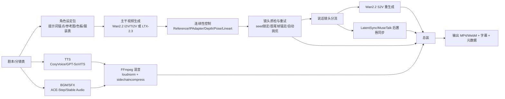
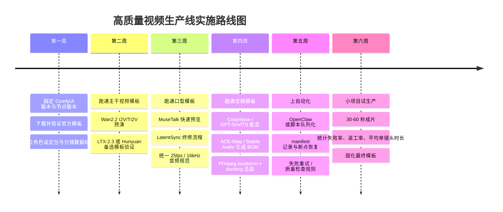

# 最新高质量视频生成完整工作流研究报告

## 执行摘要

在“剧情连续、画面稳定、神态自然、口型精确、语音与 BGM 协调、并尽量自动化”的复合目标下，**没有单一开源模型**能在 2026 年同时把五项指标都做到最好；目前最靠谱的工程结论，是把流程拆成“分镜生成主干 + 连续性控制层 + 口型同步层 + 音频生成/混音层 + 自动化编排层”五层，各层选最擅长的模型和节点，再用脚本或 OpenClaw 做队列化与恢复。这个判断来自各项目的官方定位：entity["company","Alibaba","tech company"] 系 Wan2.2 强在高质量视频生成、角色动画与 S2V 音频驱动；entity["company","Lightricks","creative software company"] 的 LTX-2.3 强在**原生音画一体**；entity["company","ByteDance","tech company"] 的 LatentSync 强在嘴型；entity["company","Tencent","tech company"] 系 MuseTalk / Hunyuan 强在实时唇同步与较低门槛视频生成；entity["company","Stability AI","ai company"] 的 Stable Audio 2.x 强在音频与企业化音频生产。citeturn13view0turn8view1turn28view2turn29view2turn10view7

如果**未指定硬件与预算**，我给出的首选路线是：  
**视频主干**优先用 Wan2.2 I2V/TI2V 生成大多数剧情镜头；**说话镜头**优先用静帧/关键帧 + 音频驱动或后置口型同步；**角色表演/换脸型镜头**优先用 Wan2.2 Animate；**极需音画同生成且能接受较高硬件门槛**时，用 LTX-2.3 做短镜头或关键镜头；**嘴型最终修正**优先 LatentSync 1.6，实时预览和批量换音可用 MuseTalk 1.5；**TTS**优先 CosyVoice 3.0（自然度/多语种）或 GPT-SoVITS（小样本克隆/中文生态）；**BGM**优先 ACE-Step 1.5（本地快、可控）或 Stable Audio 2.5（企业/API 路线）。citeturn8view3turn27view0turn8view4turn8view1turn28view3turn29view3turn10view4turn10view3turn12view0turn10view7

在 ComfyUI 里，2026 年最稳的生产思路不是“一张超级工作流吃完全部”，而是把工作流拆成四类模板：**主干视频模板、口型模板、音频模板、总装/导出模板**。官方已经为 Wan2.2、Wan2.2 S2V、LTX-2.3、HunyuanVideo 1.5、ACE-Step 提供了原生或官方示例；而 AnimateDiff-Evolved、Advanced-ControlNet、VideoHelperSuite、LatentSync/MuseTalk/TTS 则更适合做增强、修复与自动流水线拼装。citeturn5view0turn27view0turn15search8turn17view2turn12view0turn25view0turn25view4turn26view0turn27view2turn42search0turn11search5turn11search10

## 目标分解与总体结论

要同时满足“剧情连续”“画面稳定”“表情自然”“口型精确”“语音与 BGM 协调”，本质上是在解决五类不同问题：**跨镜头身份一致性**、**单镜头时序一致性**、**面部与肢体表演**、**唇形与音素对齐**、**响度与音乐让位**。Wan2.2、LTX-2.3、HunyuanVideo 1.5 主要解决前两项；Wan2.2 Animate 与 S2V 更偏向角色动作/音频驱动表现；LatentSync 与 MuseTalk 专注第四项；CosyVoice/GPT-SoVITS/ACE-Step/Stable Audio 2.x 负责第五项。把这五类任务分层，能显著降低“一个模型硬扛全部导致全局漂移”的风险。citeturn13view0turn27view0turn8view1turn17view2turn28view2turn29view2turn10view4turn10view3turn12view0turn10view7

从工程上看，**剧情连续**最有效的不是加大单次生成长度，而是采用**切片分镜 + 前后帧锚定 + 统一角色设定**。官方和官方模板都反复显示出两个事实：其一，Wan2.2 的 14B 与 5B 工作流天然适合 I2V/TI2V 以及 FLF2V；其二，LTX-2.3 官方模板与官方 workflow 把 width/height/duration/fps、latent upscaler、distilled LoRA 都做成了独立控制点，适合脚本化批调度。也就是说，真正“少费心”的做法不是长视频一次成片，而是每个镜头 3–8 秒、用固定模板自动批渲染，再做二次筛选与拼接。citeturn5view0turn35view0turn16view1turn16view2turn38view0

如果只给出一句最重要的结论：**2026 年要做高质量叙事视频，最佳实践是“Wan2.2 / LTX-2.3 负责镜头，LatentSync / MuseTalk 负责嘴，CosyVoice / GPT-SoVITS 负责声线，ACE-Step / Stable Audio 负责音乐，ComfyUI 只做编排与可视化，不要让单个图同时承担创作、修正、混音、分发四种职责。”** 这是一条基于官方项目边界与示例工作流的工程判断。citeturn13view0turn8view1turn28view2turn29view2turn10view4turn10view3turn12view0turn10view7

下表先给出“目标—手段—首选模型”的总览。

| 目标 | 最优工程手段 | 首选模型/工具 | 备注 |
|---|---|---|---|
| 剧情连续 | 分镜切片、前后帧锚定、统一角色设定 | Wan2.2 I2V/TI2V、LTX-2.3 FLF2V | 不建议一次性做很长叙事段；更适合 3–8 秒镜头链。citeturn13view0turn38view0turn35view0 |
| 画面稳定 | 参考图/IP 约束、姿态/深度控制、两阶段采样 | Wan2.2、LTX-2.3、Advanced-ControlNet | 控制层要独立于主干生成层。citeturn25view4turn16view2turn13view0 |
| 神态自然 | 音频驱动表演或角色动画 | Wan2.2 S2V、Wan2.2 Animate | S2V 更偏说话/唱歌/表演，Animate 更偏角色驱动与替换。citeturn27view0turn27view1turn13view0 |
| 口型精确 | 后置专用 lip-sync pass | LatentSync 1.6、MuseTalk 1.5 | Talking-head 优先 LatentSync；快速批改优先 MuseTalk。citeturn28view2turn29view3 |
| 语音与 BGM 协调 | TTS + Ducking + Loudness 正规化 | CosyVoice / GPT-SoVITS + FFmpeg + ACE-Step / Stable Audio | 最终混音不要交给视频模型。citeturn10view4turn10view3turn20view0turn20view1turn12view0turn10view7 |

## 主流模型与工具比较

下表聚焦 2024–2026 年对你这个目标最相关、并且能落地到 ComfyUI 生态中的模型与工具。表中的“官方/源码”列用引用代替裸链接，优先官方模型页、官方文档、源码仓库。

| 模型 / 工具 | 适用场景 | 优点 | 局限 | 关键参数 / 官方推荐 | 官方 / 源码 | 与 ComfyUI 兼容性 |
|---|---|---|---|---|---|---|
| Wan2.1 T2V / I2V / VACE | 低门槛起步、消费级显卡本地尝试、中文文本/视频生成 | 1.3B 版本仅需约 8.19GB VRAM；支持多任务；能生成中英文字；仍是低预算入门的好底座 | 质量和动态控制已被 Wan2.2 超越；更适合作为“轻量起步”而非最终主力 | 1.3B 适合 480P、短片；更适合预演、脚本验证和低成本批试错 | 官方模型页 / 源码仓库 citeturn8view2 | 原生示例与 repackaged 模型生态成熟。citeturn33search0turn34view0 |
| Wan2.2 T2V / I2V / TI2V-5B | 主力剧情镜头、角色连续 I2V、消费级 4090 路线 | MoE 14B 质量高；5B 720P@24fps、支持 T2V+I2V；官方已集成 ComfyUI；5B 适合大批量镜头生成 | A14B 单卡官方示例要 80GB 级别；镜头级仍需分段和后修 | TI2V-5B 支持 720P 24fps；官方称 5 秒 720P 可在单消费级 GPU 上生成，官方模板常见起步值约 steps 20 / CFG 3.5 / 16fps / 57 帧 | 官方模型页 / 源码 / Comfy 教程 / 官方模板 citeturn13view0turn8view3turn5view0turn35view0 | **原生支持**；是当前最值得优先放进主工作流的开源视频主干之一。citeturn13view0turn5view0 |
| Wan2.2 Animate-14B | 角色动画、角色替换、表演驱动镜头 | 官方定位就是 character animation and replacement；适合角色一致性与表情复制 | 不等于“自动完美口型”；更偏角色表演和替换，不是专用唇同步器 | 更适合和参考图/参考视频一起用；用在“表演镜头”层而非全片主干 | 官方模型页 / 源码仓库 citeturn8view4turn13view0 | 已进入 Wan2.2 官方路线图与生态，通常通过官方 Wan 集成或专用 wrapper 使用。citeturn13view0 |
| Wan2.2 S2V-14B | 对话、演唱、半身/全身音频驱动镜头 | 输入单图 + 音频即可生成同步视频；支持长音频、对话、演唱、表演；可带 pose_video | 单卡官方示例仍是 80GB 级别；更像“说话镜头专用生成器”，不宜承担整部片子的所有镜头 | 支持 480P/720P；`--pose_video` 可做姿态驱动；未设 `--num_clip` 时按音频时长自适应 | 官方模型页 / 技术页 / Comfy 教程 citeturn39view0turn27view0turn27view1 | **原生支持**；如果你能接受“从静帧重生成说话镜头”，它比后置 lipsync 更省人工。citeturn27view0turn39view0 |
| LTX-2.3 | 关键镜头、原生音画一体、需要单模型同时出视频+音频的短片段 | 官方模型卡明确是 synchronized video and audio 的单模型；有 dev / distilled / upscaler；distilled 版 8 steps、CFG=1；ComfyUI 官方节点与模板完整 | 官方 open-source 文档建议本地 32GB+ VRAM、100GB 存储；完整本地部署比 Wan 5B 更重 | 官方文档给出 32GB+ VRAM 最低要求；模型卡列出 distilled 8 steps、CFG=1；外部工程指南建议迭代 20–30 steps、终稿 40+、guidance 3.0–3.5、帧数尽量先控制在 257 内 | 官方模型卡 / 官方文档 / 官方 Comfy 节点 / 官方模板 citeturn8view1turn16view0turn16view1turn16view2turn15search12turn36view0 | **原生 + 官方扩展**；非常适合脚本化工作流与高质量短镜头。citeturn16view1turn16view2 |
| HunyuanVideo 1.5 | 24GB 级显卡本地高质量视频、720p 剧情镜头 | 8.3B；官方 Comfy 文档明确可在 24GB VRAM 消费级 GPU 上跑；支持 T2V/I2V，原生 720p 可上采样到 1080p | 原生音频和口型链条不如 LTX / Wan S2V 完整；更多作为视频主干替代 | 官方模板提供 720p I2V/T2V JSON；定位 5–10 秒高一致性镜头 | 官方 Comfy 文档 / 源码仓库 citeturn17view2turn8view8 | **原生支持**；是 24GB 级本地部署的强力备选。citeturn17view2 |
| AnimateDiff-Evolved | SD1.5/SDXL 资产复用、vid2vid 修复、滑窗长序列、运动 LoRA/Prompt travel | 支持 sliding context、ControlNet、IPAdapter、Prompt scheduling、Motion LoRA；适合“修片层” | 2026 年已不建议当最高质量主生成器；要靠底模、ControlNet、参考图才能稳 | 官方仓库强调 sliding context；HotshotXL sweetspot 为 8 帧；维护者示例里常见 `context_length 12 / overlap 2` 作为起步值；这是修复层更合适 | 源码仓库 / issue 示例 citeturn25view0turn25view1turn32search2 | **社区核心增强节点**；建议作为“增强/修复层”，不是主干生成层。citeturn25view0 |
| Advanced-ControlNet | 姿态、深度、线稿、Reference、时序调度 | 支持 timestep / latent strength scheduling、Reference、sliding context；和 AnimateDiff 联动好 | 并不自动解决角色一致性，需要你自己设权重曲线 | 文档强调 `style_fidelity`、`ref_weight`、`strength` 分别控制参考影响；支持 sliding context 里的 ControlNet/T2IAdapter/ControlLoRA | 源码仓库 citeturn25view4 | **社区必装**；是稳定画面与延长镜头的关键控制层。citeturn25view4 |
| LatentSync 1.5 / 1.6 | 高精度 talking-head 唇同步、中文口型、后置 lipsync pass | 官方给出 `inference_steps 20–50`、`guidance_scale 1.0–3.0`；1.6 改到 512×512 训练，明显缓解牙齿/嘴唇发糊；推理数据预处理要求清晰 | 1.6 官方推理最低约 18GB VRAM；最佳效果依赖 25fps、正脸、脸始终可见；动漫/侧脸并不理想 | 25fps、音频 16k；`guidance_scale` 高会更准但更抖；Comfy wrapper 还建议 `lips_expression` 默认为 1.5，口型要求高时到 2.0–2.5 | 官方源码 / 官方参数 / Comfy wrapper citeturn28view3turn28view2turn27view2 | **官方无原生，社区 wrapper 成熟**；最值得纳入说话镜头后处理。citeturn27view2 |
| MuseTalk 1.5 | 快速批量唇同步、低显存实时预览、头像换音 | 实时 30fps+ on V100；推荐 25fps 输入；可调 `bbox_shift` 修嘴开合；官方称可在 4GB 3050Ti 上慢速跑 8 秒示例 | 基于 256×256 face region；高分辨率细节与身份保持不如 LatentSync 1.6；当前 pipeline 仍可能 jitter | 官方明确建议 25fps；`bbox_shift` 正值更张嘴，负值更收嘴；先只生成第一帧调参再全量渲染 | 官方源码 / HF / Comfy wrapper citeturn29view2turn29view3turn42search0 | **社区节点可用**；适合“先快调，再必要时换 LatentSync 精修”。citeturn42search0 |
| Stable Audio 2.0 / 2.5 | BGM、音效、品牌音频、API/企业工作流 | 2.0 支持最长约 3 分钟 44.1kHz 立体声、audio-to-audio、style transfer；2.5 面向 enterprise-grade sound production | 2.5 更偏 API/商业路线；在 ComfyUI 主要通过 Partner Nodes 与外部服务接入 | 2.0 官方强调长结构音乐与 audio-to-audio；2.5 强调 quality & control；Partner Nodes 需要账户/credits | 官方产品页 / 新闻页 / Comfy Partner Nodes citeturn10view6turn10view7turn12view2 | **Partner Node / API 路线**，不是最轻的本地方案。citeturn12view2 |
| ACE-Step 1.5 | 本地 BGM、歌曲、可控配乐、长音乐 | ComfyUI 已原生支持；50+ 语言；官方称 3090 下低于 10 秒可生完整歌曲；支持 LoRA；长曲结构与规划能力强 | 更偏音乐生成，不是 TTS；复杂人声可控性仍需提示词与后期修整 | 官方文档称 5090 可约 1 秒生成 4 分钟歌，3090 低于 10 秒；LM+DiT 结构适合长曲规划 | 官方 Comfy 教程 / 项目页 / 技术页 citeturn12view0turn10view2turn10view1 | **原生支持**；如果你要自动化 BGM，本地优先级很高。citeturn12view0 |
| CosyVoice 3.0 | 多语种自然 TTS、零样本克隆、情感/韵律自然 | 官方强调 content consistency、speaker similarity、prosody naturalness 强于 2.0；支持 9 种常见语言和多种中文方言 | 在 ComfyUI 主要依赖社区节点；不是专门为口型设计，仍需后置 lip-sync | 适合旁白、人物台词、跨语种统一音色；建议与 LatentSync / MuseTalk 组合 | 官方源码 / 官方 demo 页 / 社区节点 citeturn10view4turn10view5turn11search10 | **社区节点可用**；更适合“自然配音优先”的项目。citeturn11search10 |
| GPT-SoVITS | 少样本克隆、中文配音、快速拟音色 | 5 秒样本可 zero-shot，1 分钟可 few-shot 微调；中文生态成熟；内置数据处理工具 | 自然度与长句节奏控制通常要手工调；ComfyUI 节点多为社区维护 | 适合已有目标音色的项目；与强 lipsync 组合时很实用 | 官方源码 / 社区 Comfy 节点 citeturn10view3turn11search5 | **社区节点可用**；中文创作者的实用度很高。citeturn11search5 |
| Mochi 1 / CogVideoX | 备选开源视频底座 | Mochi 1 开源、曾宣布原生 ComfyUI 支持；CogVideoX 社区 wrapper 完整 | 音频、说话、角色替换生态不如 Wan/LTX 完整；更适合做横向测试 | 更适合做“备份底座”而非你这条线的首选 | 官方仓库 / 生态说明 citeturn8view9turn8view10 | 有原生或 wrapper 路线，但不是本报告的首推主干。citeturn8view9turn8view10 |

基于上表，我的排序是：  
**总主干优先级**：Wan2.2 I2V/TI2V > LTX-2.3 > HunyuanVideo 1.5 > 其他开源底座。  
**说话镜头优先级**：Wan2.2 S2V（愿意重生成）≈ LatentSync 1.6（后置精修）> MuseTalk 1.5（快速批改）。  
**音频优先级**：CosyVoice 3.0（自然度）/ GPT-SoVITS（音色克隆） + ACE-Step 1.5（本地 BGM）或 Stable Audio 2.5（企业/API 音频）。这个排序是结合官方能力边界、ComfyUI 生态完备度和自动化便利性做出的工程推荐。citeturn13view0turn8view1turn17view2turn27view0turn28view2turn29view3turn10view4turn10view3turn12view0turn10view7

## ComfyUI 完整工作流设计

### 必装节点与推荐拓扑

如果目标是“尽量自动化、减少人工干预”，建议把 ComfyUI 环境分成三层：**原生核心层**、**视频控制层**、**语音/嘴型层**。原生核心层用最新 ComfyUI + Manager；视频控制层至少安装 VideoHelperSuite、Advanced-ControlNet、IPAdapter Plus、ControlNet Aux、AnimateDiff-Evolved、LTXVideo（如果用 LTX）；语音/嘴型层根据方案安装 LatentSync wrapper、MuseTalk wrapper、CosyVoice 或 GPT-SoVITS 节点；自动化层则接 OpenClaw 或直接用 `/prompt`、`/history`、`/ws`。ComfyUI 官方文档明确 `/prompt` 用于提交工作流、`/history` 用于轮询结果、`/ws` 用于实时进度；OpenClaw 的 `comfy` provider 则直接把工作流路径、提示词节点、输出节点抽象成配置项。citeturn26view0turn25view4turn25view0turn16view1turn43view0turn43view1turn41view1turn41view0

从实战上，推荐的工作流拓扑不是“一个主图”，而是下面这种分层：



这个拓扑的关键是：**所有说话镜头都要单独分流**。因为一旦把对白镜头和普通动作镜头混在同一个大图里，最常见的结果就是剧情连续性被嘴型修复破坏，或者嘴型修复把原本良好的动作镜头“涂坏”。Wan2.2 S2V、LatentSync、MuseTalk 本身就说明了这一点：它们都假定“输入图像/视频 + 音频”是一个独立、受控的问题。citeturn27view0turn28view2turn29view3

### 关键参数范围

下面的参数表分为“官方默认/官方提示”和“工程起步值”两类。凡是源项目已给出明确数值，我按官方写；凡是源码只给出功能、没有统一最佳值的，我明确标成**工程起步值**。

| 环节 | 参数 | 建议起步值 | 范围 / 依据 | 说明 |
|---|---|---:|---|---|
| Wan2.2 14B T2V/I2V | steps | 20 | 官方示例/官方模板常见为 20 | 先用 20 做预演，终稿如需更稳可上调，但先别同时拉高分辨率与时长。citeturn35view0 |
| Wan2.2 14B T2V/I2V | CFG | 3.5 | 官方模板为 3.5 | 这基本可以看作官方默认起点。citeturn35view0 |
| Wan2.2 14B T2V/I2V | FPS | 16 | 官方示例模板为 16fps 输出 | 叙事镜头用 16fps 起步很务实，后期再插帧到 24/25。citeturn35view0 |
| Wan2.2 14B T2V/I2V | 帧数 | 57 | 官方示例模板 | 约 3.5 秒，正好符合“镜头切片”思路。citeturn35view0 |
| Wan2.2 TI2V-5B | 分辨率 | 720P / 24fps | 官方模型卡与源码 | 5B 的价值就在“720P、24fps、消费级 GPU 可跑”。citeturn8view3turn13view0 |
| LTX-2.3 distilled | steps | 8 | 官方模型卡明确 | Distilled 版就是为少步数设计。citeturn8view1 |
| LTX-2.3 distilled | CFG | 1 | 官方模型卡明确 | 不要用 SD 类直觉把 CFG 拉高。citeturn8view1 |
| LTX-2.3 dev / 全质量 | steps | 20–30 预演，40+ 终稿 | 官方外部工程指南 + 官方本地文档语境 | 这是更符合 production 的步数区间。citeturn15search12turn16view0 |
| LTX-2.3 | Guidance | 3.0–3.5 | 外部官方合作工程建议 | 更高不一定更好，尤其会带来 motion 不自然。citeturn15search12 |
| LTX-2.3 | 帧数 | 尽量先 <257 帧 | 外部工程建议 | 镜头越短越利于自动批处理。citeturn15search12 |
| AnimateDiff-Evolved | context_length | **12 起步** | 仓库明确支持 sliding context；维护者案例给过 12/2 | 若主要做修片，12 已够；追长镜头再到 16。citeturn25view0turn32search2 |
| AnimateDiff-Evolved | context_overlap | **2 起步** | 维护者案例给过 12/2 | 这是工程起步值，不是通用最优。长度越长、动作越大，overlap 可再加。citeturn32search2 |
| AnimateDiff / HotshotXL | context_length | 8 | 仓库甜点值 | 这是项目明确提到的 sweetspot。citeturn25view1 |
| Advanced-ControlNet | 控制强度 | **0.35–0.65（参考/风格）**；**0.60–0.90（pose/depth 强约束）** | 文档说明 strength / style_fidelity / ref_weight 分别控制影响强度；数值区间为工程起步值 | 角色一致性重在“中等强度 + 时间调度”，不是无脑拉满。citeturn25view4 |
| LatentSync 1.6 | inference_steps | 20–50 | 官方源码明确 | 20 做预演，30–40 常是性价比区间。citeturn28view2 |
| LatentSync 1.6 | guidance_scale | 1.0–3.0 | 官方源码明确 | 高了更准，但会更抖、更扭。citeturn28view2 |
| LatentSync 1.6 | fps | 25 | 官方数据处理与 wrapper 均强调 | 尽可能统一全链路到 25fps。citeturn28view4turn27view2 |
| MuseTalk 1.5 | fps | 25 | 官方明确推荐 | 低于 25fps，要先补帧或重采样。citeturn29view3 |
| MuseTalk 1.5 | bbox_shift | 先默认，再微调到负/正小范围 | 官方示例给出可调范围示例 [-9, 9] | 这是嘴开合校正器。citeturn29view0 |

一句话解释这些参数：**视频主干靠“保守默认值 + 短镜头”求稳，控制层靠“中强度 + 调度”求连续，嘴型层靠“固定 fps + 专用参数”求精准。** 这是比把某一个参数拉满更可靠的自动化策略。citeturn35view0turn25view4turn28view2turn29view3

### workflow JSON 示例

真正要“一键导入即跑”，最稳妥的方法仍然是直接用官方模板：Wan2.2、Wan2.2 S2V、LTX-2.3、ACE-Step、HunyuanVideo 1.5 都已经有官方模板或官方示例 JSON。下面我给出一个**自动化友好的 `workflow_api.json` 骨架**，它适合直接喂给 ComfyUI `/prompt` 或 OpenClaw；如果你要画布导入，请优先以官方模板为底稿替换节点名和模型名。citeturn35view0turn27view0turn36view0turn12view1turn17view2

```json
{
  "1": {
    "class_type": "LoadImage",
    "inputs": {
      "image": "start_frame.png"
    }
  },
  "2": {
    "class_type": "CLIPLoader",
    "inputs": {
      "clip_name": "umt5_xxl_fp8_e4m3fn_scaled.safetensors",
      "type": "wan",
      "device": "default"
    }
  },
  "3": {
    "class_type": "UNETLoader",
    "inputs": {
      "unet_name": "wan2.2_i2v_low_noise_14B_fp8_scaled.safetensors",
      "weight_dtype": "default"
    }
  },
  "4": {
    "class_type": "VAELoader",
    "inputs": {
      "vae_name": "wan_2.1_vae.safetensors"
    }
  },
  "5": {
    "class_type": "CLIPTextEncode",
    "inputs": {
      "clip": ["2", 0],
      "text": "角色A在昏黄街灯下缓慢转身，对镜头说话，镜头轻推，表情克制而悲伤，电影感光影，写实"
    }
  },
  "6": {
    "class_type": "CLIPTextEncode",
    "inputs": {
      "clip": ["2", 0],
      "text": "低清晰度，口型错位，面部畸变，静止，背景漂移，过曝，字幕"
    }
  },
  "7": {
    "class_type": "EmptyHunyuanLatentVideo",
    "inputs": {
      "width": 1280,
      "height": 704,
      "length": 57,
      "batch_size": 1
    }
  },
  "8": {
    "class_type": "KSamplerAdvanced",
    "inputs": {
      "model": ["3", 0],
      "positive": ["5", 0],
      "negative": ["6", 0],
      "latent_image": ["7", 0],
      "add_noise": "enable",
      "noise_seed": 123456789,
      "control_after_generate": "fixed",
      "steps": 20,
      "cfg": 3.5,
      "sampler_name": "euler",
      "scheduler": "simple",
      "start_at_step": 0,
      "end_at_step": 20,
      "return_with_leftover_noise": "disable"
    }
  },
  "9": {
    "class_type": "VAEDecode",
    "inputs": {
      "samples": ["8", 0],
      "vae": ["4", 0]
    }
  },
  "10": {
    "class_type": "VHS_VideoCombine",
    "inputs": {
      "images": ["9", 0],
      "frame_rate": 16,
      "filename_prefix": "shots/scene_001",
      "format": "video/mp4",
      "save_output": true
    }
  }
}
```

如果你的目标是“剧情连续”，上面的骨架要再扩成三个版本：  
**A 版**只生成普通镜头；**B 版**在 A 版后面接 `LatentSync` 或 `MuseTalk`；**C 版**把 A 版替换成 `Wan2.2-S2V`，专门处理说话段。这样你最终只要在分镜表里给每一行标记 `shot_type = normal | dialogue | performance`，脚本就能自动选择图。citeturn27view0turn28view2turn29view3

## 口型同步、配音与 BGM

### 口型同步与配音的选型结论

如果你的镜头是**正脸、近景、对白为主**，并且优先级是“口型一定准”，我建议把 LatentSync 1.6 放在第一位。它的官方源码直接给出适合调参的两组核心参数：`inference_steps 20–50` 与 `guidance_scale 1.0–3.0`；同时明确提出 1.6 版本转向 512×512 训练以缓解 1.5 的嘴唇/牙齿模糊问题。项目也强调输入应当统一到 25fps、16k 音频，且脸要清晰、正面、全程可见。citeturn28view3turn28view2turn27view2

如果你的镜头是**大量批处理的配音改口**，或者你希望先做快调、后精修，那么 MuseTalk 1.5 更合适。它不是扩散模型，而是单步 latent inpainting；官方特别强调 25fps 最优、`bbox_shift` 会显著影响嘴开合，并建议先用第一帧调参数再全量生成。对工程流程来说，这意味着 MuseTalk 很适合做“预同步层”，而 LatentSync 适合做“终同步层”。citeturn29view2turn29view3turn29view0

TTS 方面，如果你更在意**自然度、韵律、多语种与方言**，CosyVoice 3.0 更强；如果你更在意**只给几秒到一分钟目标声音就能快速克隆**，GPT-SoVITS 更实用。两者都不应被当成 lip-sync 替代品，而应该看作音频源。我的建议是：**长旁白/多语言项目优先 CosyVoice 3.0；有明确角色音色参考、中文内容多时优先 GPT-SoVITS。** citeturn10view4turn10view5turn10view3

下表给出更直接的选型建议。

| 方案 | 何时选 | 优点 | 风险 | 结论 |
|---|---|---|---|---|
| LatentSync 1.6 + CosyVoice / GPT-SoVITS | 近景对白、口型必须准 | 唇同步精度高；中文支持增强；参数边界明确 | 需要更高显存；正脸依赖强 | **默认首选**。citeturn28view3turn28view2turn10view4turn10view3 |
| MuseTalk 1.5 + CosyVoice / GPT-SoVITS | 批量试音、快预览、低算力调参 | 快、低门槛、可调 `bbox_shift` | 高分细节与身份保持弱于 LatentSync | **先快后精** 的好方案。citeturn29view3turn29view0turn10view4turn10view3 |
| Wan2.2 S2V | 静帧说话人、唱歌、表演镜头 | 直接从图+音频出视频；神态动作更自然 | 是“重生成”，不是简单修嘴；算力重 | **对白镜头专用生成器**。citeturn27view0turn39view0 |
| LTX-2.3 原生音画 | 短镜头、原生 AV、一体生成 | 单模型同时生成音频和视频 | 本地门槛高，细调复杂 | **高规格关键镜头备选**。citeturn8view1turn16view0 |

### 可执行操作步骤

最稳的操作顺序是：  
先用 TTS 生成**最终节奏版**台词，再锁定语音长度和呼吸停顿；然后把这条音频作为嘴型同步的唯一音源。不要先做嘴型、后改 TTS 文案，否则几乎一定要返工。LatentSync 与 MuseTalk 的官方资料都表明，fps、音频采样率、口型幅度参数都会影响最终同步效果；这就决定了**“声音先定稿”**比“视频先定稿”更省心。citeturn28view4turn29view3

实际步骤建议如下：  
先把所有对白音频统一为 **25fps 对应的视频节奏**和 **16kHz 工作音频**；对白镜头抽取或生成干净的人脸段；用 MuseTalk 先跑一版快速预览，调 `bbox_shift` 或说话幅度；满意后再用 LatentSync 1.6 做终同步；如果是静帧角色且你还要体态表演，那么直接走 Wan2.2 S2V 反而更省后修。citeturn28view4turn29view3turn27view0

### 自动化混音流程与 FFmpeg 命令

FFmpeg 官方文档说明，`loudnorm` 用于 EBU R128 响度标准化，可做单通道或双通道、单通或双通；`sidechaincompress` 是标准 sidechain 压缩器；`alimiter` 是 lookahead limiter；`concat` demuxer 适合顺序拼接相同编码参数的文件。对在线视频，常见目标是主混音约 **-16 LUFS**，再用 ducking 让 BGM 自动给人声让位。citeturn20view0turn20view1turn20view2turn20view3turn19search18

**建议的自动化混音顺序**是：  
先对 TTS/对白单独降噪与规范化，再对 BGM 做轻压缩，之后用 sidechain 让 BGM 自动下潜，最后全片再做一次总线 loudnorm 和 limiter。这样最接近广播与短视频平台的可交付状态。citeturn20view0turn20view1turn20view3

下面给出一套可直接抄走的命令骨架。

**单独规范化对白：**

```bash
ffmpeg -i dialogue.wav \
  -af "loudnorm=I=-16:LRA=7:TP=-1.5" \
  dialogue_norm.wav
```

**BGM 自动给人声让位：**

```bash
ffmpeg -i bgm.wav -i dialogue_norm.wav \
  -filter_complex "[0:a][1:a]sidechaincompress=threshold=0.05:ratio=8:attack=10:release=250:knee=2.5:detection=rms[bgmduck];
                   [bgmduck][1:a]amix=inputs=2:weights='1 1':normalize=0,
                   alimiter=limit=0.95:attack=5:release=50" \
  mix.wav
```

**把最终混音灌回视频并做总线响度校正：**

```bash
ffmpeg -i video_noaudio.mp4 -i mix.wav \
  -map 0:v -map 1:a \
  -c:v copy -c:a aac -b:a 320k \
  -af "loudnorm=I=-16:LRA=7:TP=-1.5,alimiter=limit=0.95:attack=5:release=50" \
  final_master.mp4
```

**镜头切片的无损式顺序拼接：**

```bash
# shots.txt
# ffconcat version 1.0
# file shot_001.mp4
# file shot_002.mp4
# file shot_003.mp4

ffmpeg -f concat -safe 0 -i shots.txt -c copy assembled.mp4
```

上面 sidechain 的 `threshold / ratio / attack / release` 是我的**工程起步值**，不是 FFmpeg 官方“最佳预设”；但这些参数本身都在官方滤镜文档中有定义和范围，你可以稳定地把它们脚本化。对于对白片，先从 `threshold 0.05 / ratio 8 / attack 10 / release 250` 开始，通常已经能显著减少“语音一出来，BGM 还在抢位置”的问题。citeturn20view1turn20view3

## 自动化编排、错误恢复与资源估算

### OpenClaw 与脚本调度

OpenClaw 对你这种“尽量少人工”的诉求很有价值，因为它并不是重新理解 ComfyUI 图，而是把 ComfyUI workflow 当成一个**可配置的黑盒任务**：你在配置里指定 `workflowPath`、`promptNodeId`、`outputNodeId`，OpenClaw 再通过 ComfyUI 的 `/prompt`、`/history`、`/view` 接口提交、轮询、取回结果。这种模式非常适合把“同一张图、不同镜头文本、不同输入参考图”跑成批处理。citeturn41view1turn43view0turn43view1

OpenClaw 官方 `comfy` provider 已经明确支持 `image_generate`、`video_generate`、`music_generate` 三类共用工作流能力；而 ComfyUI-OpenClaw 这一侧则补上了 webhooks、schedules、approvals、presets、model manager、remote admin console 等生产化能力。也就是说，如果你想把“晚上一键排队，第二天看结果”做到更接近产品级，OpenClaw 比一堆零散 bat/sh 脚本更整齐；但如果你只是单机本地跑，直接脚本调 `/prompt` 也完全够用。citeturn41view1turn41view0turn41view2

推荐的自动化编排规则如下：  
**镜头为最小任务单元**，每个镜头持有独立 JSON 配置；主干镜头输出后立即写入 manifest；对白镜头自动进入 lip-sync 队列；所有任务输出以 `project/scene/shot/pass` 目录层级落盘；脚本记录 `prompt_id`、seed、模型版本、输入图 hash、音频 hash；失败后优先 retry 同任务，不要全片重跑。ComfyUI 官方 API 提供了构建这一套的基础接口。citeturn43view0turn43view1

下面给一个 OpenClaw 配置骨架，它展示了你应当如何把“主干视频图”“音乐图”与“提示词节点”抽出来，交给统一调度层。

```json
{
  "models": {
    "providers": {
      "comfy": {
        "mode": "local",
        "baseUrl": "http://127.0.0.1:8188",
        "video": {
          "workflowPath": "./workflows/video-main-api.json",
          "promptNodeId": "12",
          "outputNodeId": "21",
          "inputImageNodeId": "1",
          "timeoutMs": 1800000,
          "pollIntervalMs": 3000
        },
        "music": {
          "workflowPath": "./workflows/music-api.json",
          "promptNodeId": "3",
          "outputNodeId": "18"
        }
      }
    }
  },
  "agents": {
    "defaults": {
      "videoGenerationModel": {
        "primary": "comfy/workflow"
      }
    }
  }
}
```

### 并行化与错误恢复

并行化最好做在**分镜层**，不要做在**单镜头的巨大图**内部。原因很简单：Wan2.2 A14B、LTX-2.3 dev/full 这类模型本来就吃显存，你在单图里堆太多节点，失败概率和恢复成本都会同时上升。更稳的做法是让每个 shot 都有 `draft -> refine -> lipsync -> mixdown` 四个 stage，每完成一个 stage 就把结果固化到磁盘，并写 manifest。这样即使中途 OOM、网络波动、节点升级崩掉，也只回滚到当前镜头当前阶段。这个“阶段固化”策略与 OpenClaw 的 workflow 驱动模式、ComfyUI 的 `/history` 查询模式天然兼容。citeturn16view0turn39view0turn41view1turn43view1

我建议至少做五个自动恢复机制：  
**显存退避**（先降分辨率，再降帧数，再切 5B/轻模型）、**节点重试**（同 seed 重试一次，不成功再换 seed）、**输出校验**（检测空文件/零时长/无音轨）、**镜头跳过**（失败镜头先记红，不阻塞全片）、**版本锁**（不要边生产边升级节点）。很多实际故障都来自节点或模型版本漂移，而不是提示词本身。LTX-2.3、Wan2.2、LatentSync wrapper 等项目的 issue 与文档都反复提示版本和依赖的一致性很重要。citeturn16view1turn27view2turn13view0

### 资源估算

由于你的硬件与预算都标注为**未指定**，下面给的是三档建议，而不是硬性门槛。表中的显存/存储主要参考官方最低要求，再叠加镜头缓存、音频资产和多版本重试的工程冗余。

| 档位 | 适合项目 | 建议硬件 | 建议模型组合 | 说明 |
|---|---|---|---|---|
| 小项目 | 30–90 秒成片，10–30 个镜头，单人本地 | RTX 4090 / 5090 级 24–32GB；RAM 64GB；NVMe 2TB | Wan2.2 TI2V-5B 或 HunyuanVideo 1.5 + MuseTalk / LatentSync + CosyVoice / GPT-SoVITS + ACE-Step | 这是最现实的“个人工作站”形态。Wan 5B 面向消费级 GPU，Hunyuan 1.5 面向 24GB，LatentSync 1.6 约 18GB 推理，MuseTalk 可更低但更慢。citeturn8view3turn17view2turn28view2turn29view3turn12view0 |
| 中项目 | 1–5 分钟成片，50–150 个镜头，批处理明显 | 单张 A100 80GB / H100，或双 4090 + 大内存；RAM 128GB；NVMe 4TB | Wan2.2 A14B / S2V + LatentSync 1.6；或 LTX-2.3 distilled/dev + 专用 TTS/BGM | Wan2.2 A14B 与 S2V 官方单卡示例都偏 80GB 级；LTX 官方 open-source 文档建议 32GB+，但生产上更建议更高显存与更大缓存。citeturn13view0turn39view0turn16view0 |
| 大项目 | 广告系列、短剧/栏目、多人协作、需要高并发 | 4×A100/H100 或云集群；RAM 256GB+；对象存储/SSD 8TB+ | Wan2.2 全家桶 + LTX-2.3 关键镜头 + OpenClaw 编排 + FFmpeg 总装 | 要把镜头、音频、拼装彻底解耦，并为重试与版本回滚留空间。citeturn13view0turn16view0turn41view1 |

这里要特别提醒：**LTX-2.3 官方 open-source 文档的最低要求比很多社区体验贴更保守**，写的是 32GB+ VRAM、100GB+ 存储，推荐 A100/H100；而 Wan2.2 14B / S2V 的单卡官方命令则直接写了“至少 80GB VRAM”。因此，若你没有高显存卡，优先落在 Wan2.2 5B、HunyuanVideo 1.5、MuseTalk、GPT-SoVITS、ACE-Step 这条线更现实。citeturn16view0turn13view0turn39view0turn17view2turn12view0

## 风险、常见问题与实施路线图

### 风险与常见问题

最常见的问题其实不是“模型不够强”，而是**流程耦合太深**。下面这张故障表里，前四项几乎占了实际返工的绝大多数。

| 问题 | 常见症状 | 根因 | 解决策略 |
|---|---|---|---|
| 角色漂移 | 发型、衣服、脸型跨镜头变化 | 直接 T2V 长视频，无锚定参考 | 改为 I2V/TI2V 或 FLF2V；建立角色设定包；中强度 Reference / IP 控制。citeturn13view0turn38view0turn25view4 |
| 画面抖动 / 局部变形 | 脸、手、背景轻微呼吸感 | CFG 太高、镜头太长、control 太猛 | 先缩短镜头，再降低 guidance / CFG，再减弱局部控制。citeturn28view2turn15search12 |
| 口型准但表情僵 | 嘴对了，眼神/脸部情绪不对 | 纯 lipsync 只修口，不修表演 | 对重要对白镜头改走 Wan2.2 S2V 或先生成更强表演底片。citeturn27view0turn27view1 |
| 表情自然但嘴不准 | 神态很像说话，但音素错位 | 依赖 S2V/视频模型直接说话，没有专用终修 | 末端追加 LatentSync 1.6 精修。citeturn28view2turn27view0 |
| BGM 抢台词 | 台词一出音乐仍顶住主声 | 没做 ducking / loudness 管理 | 用 `sidechaincompress + loudnorm + alimiter` 做总线规范化。citeturn20view0turn20view1turn20view3 |
| OOM / 任务中断 | 长镜头或高分辨率直接崩掉 | 单镜头图过大、模型太重 | 降分辨率、降帧数、切 5B / distilled、按镜头阶段断点续跑。citeturn16view0turn39view0 |
| 升级后工作流失效 | 同一图昨天能跑今天不能跑 | 节点版本漂移、依赖冲突 | 锁版本；生产期不要随意升级；分环境测试。citeturn16view1turn27view2 |

### 实施路线图

如果你要“尽量少费心”，最合理的时间线不是一上来就拼最终片，而是先把模板和自动化跑通。下面是我建议的路线图。



对应的里程碑建议很简单：  
**第一个里程碑**不是“第一条成片”，而是“同一镜头能重复得到可接受结果”；  
**第二个里程碑**是“同一角色跨三个镜头不漂”；  
**第三个里程碑**是“对白镜头一键从 TTS 到成片”；  
**第四个里程碑**才是“整支片从分镜表自动排队到出片”。只有按这个顺序推进，自动化才真的会减少人工，而不是把返工自动化。citeturn41view1turn43view0turn28view2turn29view3turn12view0

### 开放问题与局限

有几件事需要明确说明。第一，AnimateDiff-Evolved 与 Advanced-ControlNet 的**精确最佳数值**并没有统一官方推荐，因此我给出的 `context_length / overlap / ControlNet 强度` 是工程起步值，不应被误解为唯一正确答案。第二，像 LatentSync、MuseTalk 这类嘴型模型在**侧脸、遮挡、动漫、夸张表演**场景下仍然有局限。第三，LTX-2.3 和 Wan2.2 S2V 虽然很强，但本地硬件门槛不低；如果你的最终环境不具备相应显存，应该优先从 Wan2.2 5B / Hunyuan 1.5 / MuseTalk 这条更现实的路线起步。citeturn25view0turn25view4turn28view2turn29view2turn16view0turn39view0

综合来看，**对“尽量自动化、尽量少费心”的用户，最值得先落地的一套组合是：Wan2.2 I2V/TI2V 作为镜头主干，LatentSync 1.6 作为嘴型终修，CosyVoice 3.0 或 GPT-SoVITS 作为配音源，ACE-Step 1.5 作为本地 BGM，FFmpeg 负责总线混音，OpenClaw 或 `/prompt` 脚本负责队列与恢复。** 这套组合不是最炫的，但从 2026 年公开文档、官方模板、社区节点成熟度和自动化可维护性来看，它是目前最接近“高质量 + 可批量 + 少人工”的完整工作流。citeturn13view0turn28view2turn10view4turn10view3turn12view0turn41view1turn43view0